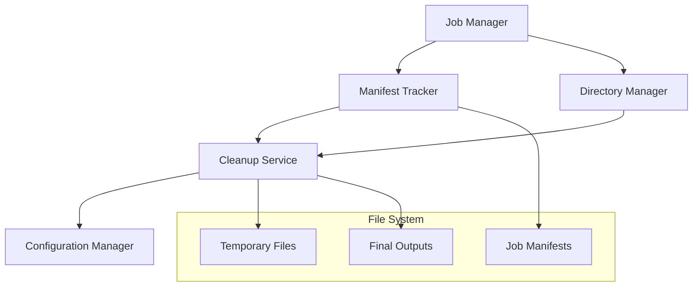

# Design Document

## Overview

The File System Cleanup and Management feature will implement intelligent file system management for the LangFlix video generation system. The current system creates complex directory structures and leaves temporary files scattered throughout the output directories, leading to disk space waste and organizational issues.

This design introduces a comprehensive cleanup service with job tracking, configurable policies, and simplified output structures. The solution will maintain backward compatibility while providing better resource management and user experience.

## Architecture

The file system cleanup system consists of four main components:



### Component Responsibilities

- **Job Manager**: Orchestrates file system operations for video generation jobs
- **Manifest Tracker**: Tracks all files and directories created during job execution
- **Directory Manager**: Handles intelligent directory creation and organization
- **Cleanup Service**: Performs automated and manual cleanup operations
- **Configuration Manager**: Manages cleanup policies and retention settings

## Components and Interfaces

### Job Manager

```python
class JobManager:
    def start_job(self, job_id: str, job_type: JobType) -> JobContext
    def complete_job(self, job_id: str, success: bool) -> None
    def get_job_context(self, job_id: str) -> Optional[JobContext]
```

The Job Manager coordinates all file system operations for a video generation job. It creates job contexts, manages job lifecycle, and triggers appropriate cleanup actions based on job completion status.

### Manifest Tracker

```python
class ManifestTracker:
    def create_manifest(self, job_id: str) -> Path
    def add_file(self, job_id: str, file_path: Path, file_type: FileType) -> None
    def add_directory(self, job_id: str, dir_path: Path, dir_type: DirectoryType) -> None
    def get_manifest(self, job_id: str) -> JobManifest
    def remove_from_manifest(self, job_id: str, path: Path) -> None
```

The Manifest Tracker maintains a comprehensive record of all files and directories created during job execution. This enables precise cleanup operations and provides audit trails for debugging.

### Directory Manager

```python
class DirectoryManager:
    def create_job_directories(self, job_context: JobContext) -> DirectoryStructure
    def should_create_directory(self, dir_type: DirectoryType, job_type: JobType) -> bool
    def get_simplified_structure(self, job_type: JobType) -> DirectoryStructure
```

The Directory Manager implements intelligent directory creation, only creating directories that are actually needed for the specific job type. It also provides simplified, predictable directory structures.

### Cleanup Service

```python
class CleanupService:
    def cleanup_job(self, job_id: str, preserve_on_failure: bool = True) -> CleanupResult
    def cleanup_by_age(self, max_age_hours: int) -> CleanupResult
    def manual_cleanup(self, pattern: str, dry_run: bool = False) -> CleanupResult
    def is_cleanup_enabled(self) -> bool
```

The Cleanup Service performs all cleanup operations based on job manifests, configuration policies, and manual requests. It supports both automatic and manual cleanup modes.

## Data Models

### JobContext

```python
@dataclass
class JobContext:
    job_id: str
    job_type: JobType
    start_time: datetime
    output_dir: Path
    manifest_path: Path
    directories: DirectoryStructure
    temp_files: List[Path]
    final_outputs: List[Path]
```

### JobManifest

```python
@dataclass
class JobManifest:
    job_id: str
    created_at: datetime
    job_type: JobType
    files: Dict[FileType, List[Path]]
    directories: Dict[DirectoryType, List[Path]]
    status: JobStatus
    cleanup_policy: CleanupPolicy
```

### DirectoryStructure

```python
@dataclass
class DirectoryStructure:
    base_dir: Path
    temp_dir: Optional[Path]
    slides_dir: Optional[Path]
    expressions_dir: Optional[Path]
    shorts_dir: Optional[Path]
    long_form_dir: Optional[Path]
    metadata_dir: Optional[Path]
```

### CleanupPolicy

```python
@dataclass
class CleanupPolicy:
    enabled: bool
    retention_hours: int
    file_types_to_clean: List[FileType]
    preserve_on_failure: bool
    debug_mode_disables: bool
```

## Correctness Properties

*A property is a characteristic or behavior that should hold true across all valid executions of a system-essentially, a formal statement about what the system should do. Properties serve as the bridge between human-readable specifications and machine-verifiable correctness guarantees.*

### Property Reflection

After reviewing all properties identified in the prework analysis, I found several areas where properties can be consolidated:

- Properties 2.1, 2.2, and 2.3 (cleanup of different temporary file types) can be combined into a single comprehensive property about temporary file cleanup
- Properties 3.1, 3.2, 3.3, and 3.4 (manifest operations) can be consolidated into properties about manifest lifecycle and usage
- Properties 4.1, 4.2, and 4.3 (configuration options) can be combined into a single property about configuration respect
- Properties 5.1, 5.2, and 5.3 (output organization) can be consolidated into a comprehensive output structure property

### Property 1: Conditional Directory Creation
*For any* video generation job, the system should create only the directories required for that specific job type, and should not create directories for unused job types.
**Validates: Requirements 1.1, 1.2**

### Property 2: Successful Job Cleanup
*For any* successfully completed video generation job, the cleanup service should remove all temporary files (slides, expressions, intermediate videos) while preserving final outputs.
**Validates: Requirements 2.1, 2.2, 2.3**

### Property 3: Failed Job Preservation
*For any* failed video generation job, the cleanup service should preserve all temporary files for debugging purposes.
**Validates: Requirements 2.4**

### Property 4: Directory Naming Consistency
*For any* created directory, the directory name should follow predictable, simplified naming conventions that are consistent across all job types.
**Validates: Requirements 1.4**

### Property 5: Manifest Lifecycle Management
*For any* video generation job, the system should create a manifest at job start, update it during processing, use it for cleanup, and preserve it until cleanup completion.
**Validates: Requirements 3.1, 3.2, 3.3, 3.4**

### Property 6: Configuration Policy Respect
*For any* cleanup operation, the system should respect all configured policies including enable/disable status, retention periods, file type selections, and debug mode settings.
**Validates: Requirements 4.1, 4.2, 4.3, 4.4**

### Property 7: Manual Cleanup Availability
*For any* administrative cleanup request, the system should provide manual cleanup commands that work correctly regardless of automatic cleanup settings.
**Validates: Requirements 4.5**

### Property 8: Cleanup Error Logging
*For any* partially failed cleanup operation, the system should log which specific files could not be removed.
**Validates: Requirements 3.5**

### Property 9: Retention Period Enforcement
*For any* temporary file, the system should maintain it for at least the configured retention period before cleanup.
**Validates: Requirements 2.5**

### Property 10: Output Structure Organization
*For any* video generation job, the system should organize final outputs in a flat, predictable structure that is separate from temporary processing files and uses consistent naming patterns.
**Validates: Requirements 5.1, 5.2, 5.3**

### Property 11: Job Status Directory Indication
*For any* completed job, the directory structure should provide clear indicators of the job completion status.
**Validates: Requirements 5.4**

### Property 12: Backward Compatibility Preservation
*For any* existing output consumer, the new file system structure should maintain compatibility with existing access patterns.
**Validates: Requirements 5.5**

## Error Handling

The system implements comprehensive error handling across all components:

### Cleanup Failures
- Partial cleanup failures are logged with specific file paths
- Failed cleanup operations don't prevent job completion
- Retry mechanisms for transient file system errors
- Graceful degradation when cleanup services are unavailable

### Manifest Corruption
- Manifest validation on load with automatic repair attempts
- Fallback to directory scanning when manifests are corrupted
- Backup manifest creation for critical jobs

### Permission Issues
- Proper handling of file permission errors in containerized environments
- Alternative cleanup strategies when direct deletion fails
- User notification for permission-related cleanup failures

### Configuration Errors
- Default fallback values for all configuration options
- Validation of configuration values at startup
- Runtime configuration change handling

## Testing Strategy

The testing strategy employs both unit tests and property-based tests to ensure comprehensive coverage:

### Unit Tests
Unit tests will focus on:
- Specific examples of directory creation for different job types
- Edge cases like empty job contexts or missing configuration
- Error conditions such as permission failures or disk space issues
- Integration points between components
- Manual cleanup command functionality

### Property-Based Tests
Property-based tests will verify universal properties across all inputs:
- Directory creation behavior across all job type combinations
- Cleanup operations across various file system states
- Manifest operations with randomly generated job data
- Configuration policy enforcement with random policy combinations
- Output structure consistency across different job scenarios

Each property-based test will run a minimum of 100 iterations to ensure comprehensive input coverage. Tests will be tagged with comments referencing their corresponding design properties:

```python
# Feature: file-system-cleanup, Property 1: Conditional Directory Creation
def test_conditional_directory_creation_property():
    # Property-based test implementation
```

### Test Configuration
- Property tests: minimum 100 iterations per test
- Unit tests: focus on concrete examples and edge cases
- Integration tests: verify component interactions
- Performance tests: ensure cleanup operations complete within reasonable time limits