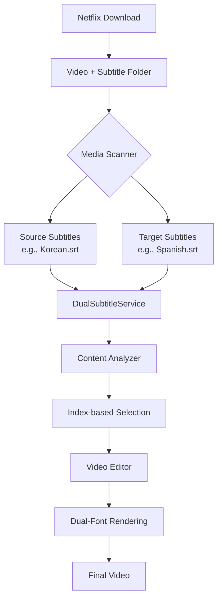

# LangFlix Architecture

## Overview

LangFlix uses a dual-language subtitle architecture that leverages pre-existing professional translations from Netflix downloads, combined with AI-powered contextual localization.



## Core Components

### 1. Netflix Folder Detection

**File:** `langflix/media/media_scanner.py`

Automatically detects Netflix-format subtitle folders:

```
video.mp4
video/              ← Folder with same name as video
├── 7_English.srt
├── 4_Korean.srt
├── 13_Spanish.srt
└── ...
```

### 2. Dual Subtitle Service

**File:** `langflix/core/dual_subtitle.py`

Loads and aligns source + target subtitle pairs:

```python
dual_sub = get_dual_subtitle_service(
    video_folder_path,
    source_language="Korean",
    target_language="Spanish"
)
```

### 3. Content Analyzer

**File:** `langflix/core/content_selection_analyzer.py`

Index-based expression selection (no translation):

- Input: Source dialogues + Target dialogues
- Output: Expression indices, not text or timestamps
- Token efficiency: Uses indices instead of full text

### 4. Dual-Font Video Editor

**File:** `langflix/core/video_editor.py`

Renders vocabulary annotations with correct fonts:

```
[thrown in] : [lanzado]
     ↑           ↑
  English    Spanish
 font       font
```

### 5. Contextual Localization Pipeline

**File:** `langflix/pipeline/orchestrator.py`

The pipeline orchestrates context-aware translation:

1. **Show Bible** - Static context from Wikipedia (characters, relationships)
2. **Chunk Summaries** - Micro-context with emotional tone
3. **Contextual Translation** - Localized with full context via LLM

## Data Flow

### Workflow

```
1. Detect Netflix subtitle folder
2. Load source subtitle file
3. Create/load Show Bible for character context
4. Extract expressions with chunk summaries
5. Translate expressions with LLM using full context awareness
6. Render video with dual fonts
```

## Configuration

```yaml
# config/default.yaml
dual_language:
  enabled: true
  source_language: "Korean" # Language to learn FROM
  target_language: "Spanish" # User's native language

  subtitle_discovery:
    auto_detect: true # Auto-find Netflix folders
    source_pattern: "*English*" # Pattern for source subs
    target_pattern: "*Korean*" # Pattern for target subs

pipeline:
  show_bible:
    use_wikipedia: true # Fetch Show Bible from Wikipedia
```

## Pipeline Integration

**File:** `langflix/main.py`

```python
def run(self, ...):
    if settings.is_dual_language_enabled():
        # Use dual-language analysis
        expressions = self._run_dual_language_analysis(...)
    else:
        # Fallback to single-language mode
        expressions = self._run_single_language_analysis(...)
```

## API

### Form Parameters

```python
# POST /api/v1/jobs
source_language: Optional[str]  # e.g., "en", "ko"
target_languages: List[str]     # e.g., ["ko", "ja", "es"]
```

### Job Data Fields

```python
job_data = {
    "source_language": "en",
    "target_languages": ["ko"],
    ...
}
```

## Related Documents

- [FEATURE_GLOSSARY.md](./FEATURE_GLOSSARY.md) - Standard terminology
- [CONFIGURATION.md](./CONFIGURATION.md) - Configuration reference
- [PIPELINE_ARCHITECTURE.md](./PIPELINE_ARCHITECTURE.md) - Detailed pipeline docs
