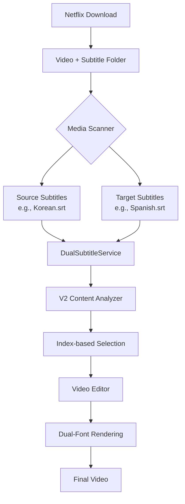

# LangFlix V2 Architecture

## Overview

LangFlix V2 introduces a dual-language subtitle architecture that eliminates expensive LLM translation calls by using pre-existing professional translations from Netflix downloads.



## Core Components

### 1. Netflix Folder Detection
**File:** `langflix/media/media_scanner.py`

Automatically detects Netflix-format subtitle folders:
```
video.mp4
video/              ← Folder with same name as video
├── 7_English.srt
├── 4_Korean.srt
├── 13_Spanish.srt
└── ...
```

### 2. Dual Subtitle Service
**File:** `langflix/core/dual_subtitle.py`

Loads and aligns source + target subtitle pairs:
```python
dual_sub = get_dual_subtitle_service(
    video_folder_path,
    source_language="Korean",
    target_language="Spanish"
)
```

### 3. V2 Content Analyzer
**File:** `langflix/core/content_selection_analyzer.py`

Index-based expression selection (no translation):
- Input: Source dialogues + Target dialogues
- Output: Expression indices, not text or timestamps
- Token reduction: ~70% vs V1

**Prompt Template:** `langflix/templates/expression_analysis_prompt_v8.txt`

### 4. Dual-Font Video Editor
**File:** `langflix/core/video_editor.py`

Renders vocabulary annotations with correct fonts:
```
[thrown in] : [lanzado]
     ↑           ↑
  English    Spanish
 font       font
```

## Data Flow Comparison

### V1 Flow (Single Subtitle + LLM Translation)
```
1. Load single subtitle file
2. Parse dialogues → LLM
3. LLM selects expressions AND translates
4. Render video with single font
```

### V2 Flow (Dual Subtitles, No Translation)
```
1. Detect Netflix subtitle folder
2. Load source + target subtitle files
3. LLM selects expressions (returns indices)
4. Look up text + timestamps from indices
5. Render video with dual fonts
```

## Configuration

```yaml
# config/default.yaml
dual_language:
  enabled: true
  source_language: "Korean"    # Language to learn FROM
  target_language: "Spanish"   # User's native language
  
  subtitle_discovery:
    auto_detect: true           # Auto-find Netflix folders
    source_pattern: "*English*" # Pattern for source subs
    target_pattern: "*Korean*"  # Pattern for target subs
```

## Pipeline Integration

**File:** `langflix/main.py`

```python
def run(self, ...):
    # V2 mode check
    if settings.is_dual_language_enabled():
        expressions = self._run_v2_analysis(...)
    else:
        expressions = self._run_v1_analysis(...)
```

## API Changes

### New Form Parameters
```python
# POST /api/v1/jobs
source_language: Optional[str]  # V2: e.g., "en", "ko"
```

### New Job Data Fields
```python
job_data = {
    "source_language": "en",  # V2: Source language code
    ...
}
```

## Token Usage Comparison

| Prompt Section | V1 Tokens | V2 Tokens |
|----------------|-----------|-----------|
| Dialogues output | ~200 | 0 (not needed) |
| Translation output | ~200 | 0 (pre-existing) |
| Timestamps | ~50 | 20 (indices only) |
| **Total per expression** | **~450** | **~150** |

**Savings: ~67% fewer output tokens per expression**

## Related Documents

- [V2_PROMPT_REQUIREMENTS.md](./V2_PROMPT_REQUIREMENTS.md) - LLM prompt specifications
- [FEATURE_GLOSSARY.md](./FEATURE_GLOSSARY.md) - Standard terminology
- [v1/ARCHITECTURE.md](./v1/ARCHITECTURE.md) - Original V1 architecture
