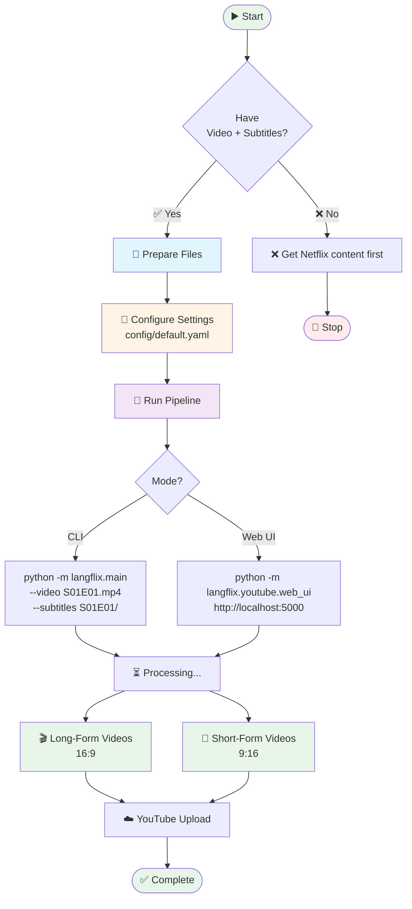
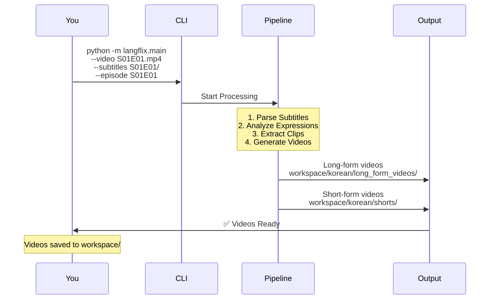
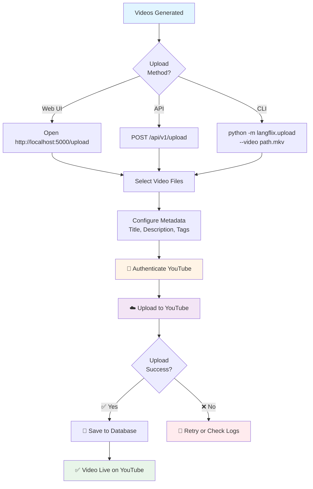
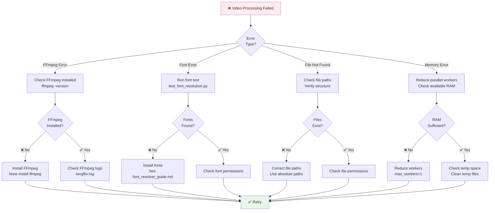
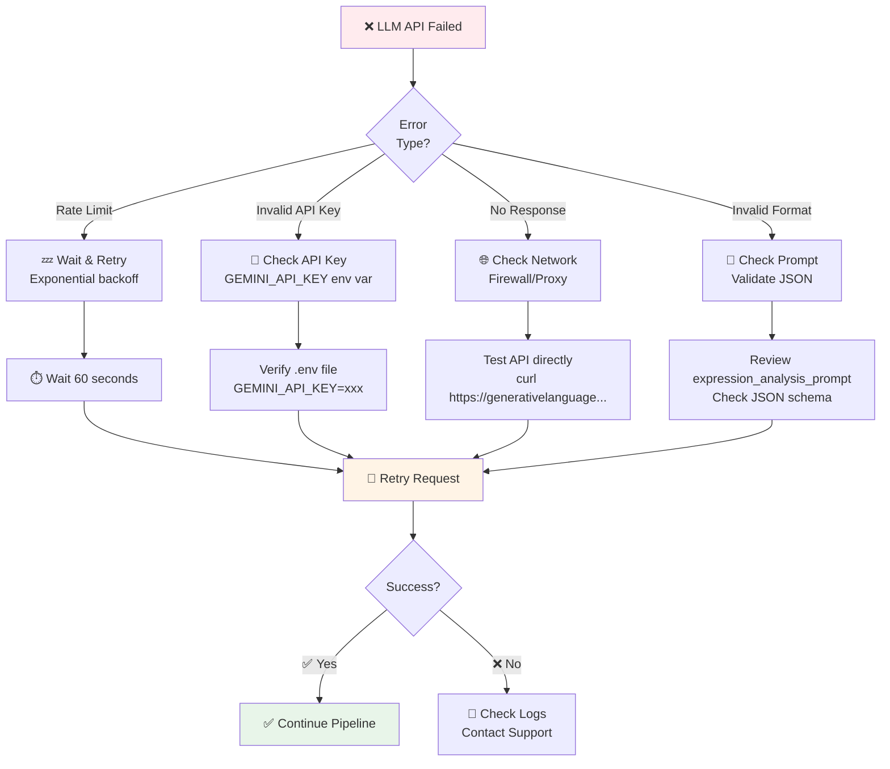
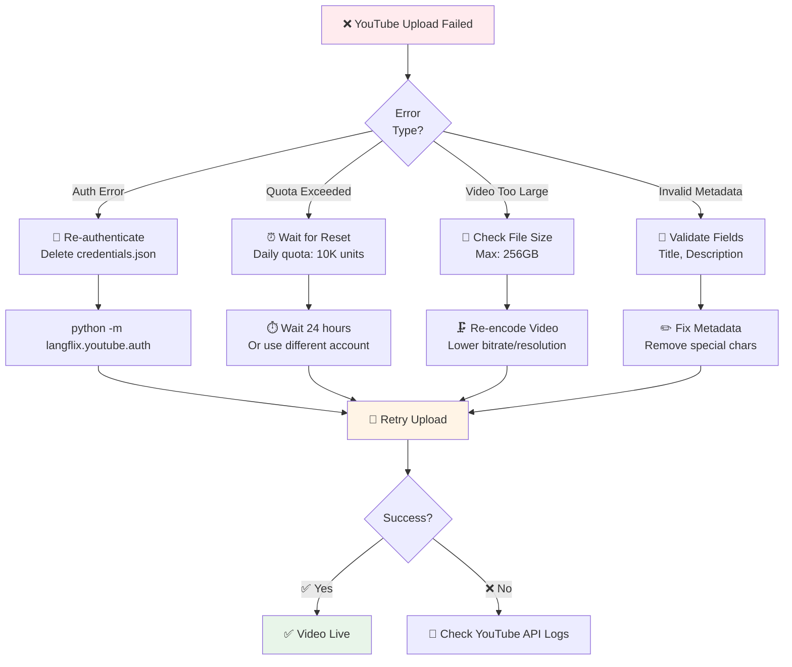
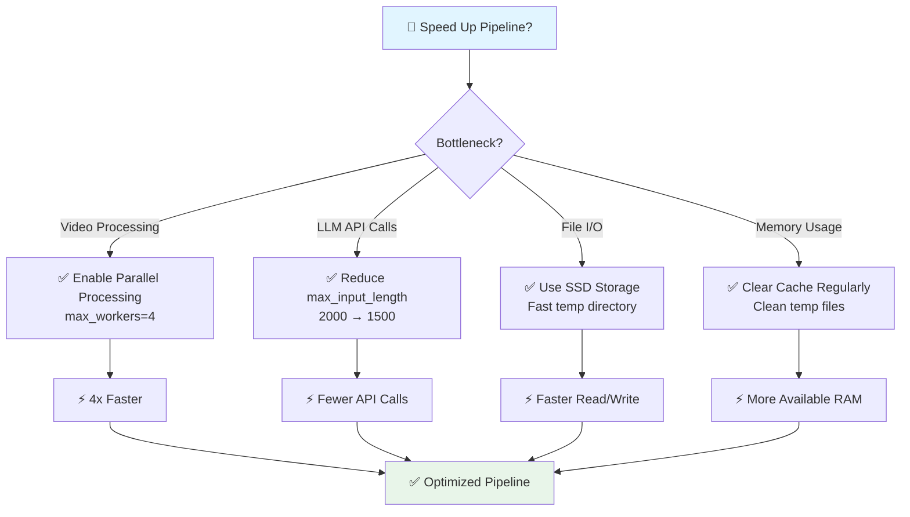
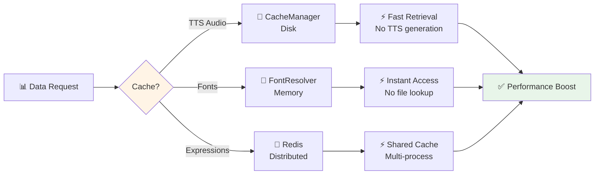

# LangFlix Quick Reference Guide

> **Visual workflows for common tasks**

## 📋 Table of Contents
- [Pipeline Workflows](#pipeline-workflows)
- [Component Usage](#component-usage)
- [Common Tasks](#common-tasks)
- [Troubleshooting](#troubleshooting)

---

## Pipeline Workflows

### Running the Complete Pipeline



### File Preparation Workflow

```mermaid
flowchart LR
    A[📺 Netflix Episode<br/>S01E01.mp4] --> B[📁 Create Folder Structure]

    B --> C{Subtitle<br/>Format?}

    C -->|Netflix Folder| D1[S01E01/<br/>├── 7_English.srt<br/>├── 4_Korean.srt<br/>└── 13_Spanish.srt]

    C -->|Single File| D2[S01E01.ko.srt<br/>S01E01.es.srt]

    D1 --> E[🔧 Enable dual_language<br/>in config]
    D2 --> E

    E --> F[⚙️ Set source_language<br/>e.g., "Korean"]
    F --> G[⚙️ Set target_language<br/>e.g., "Spanish"]

    G --> H[✅ Ready to Run]

    style A fill:#e1f5ff
    style E fill:#fff4e6
    style F fill:#fff4e6
    style G fill:#fff4e6
    style H fill:#e8f5e9
```

---

## Component Usage

### Using PathResolver

```mermaid
flowchart TD
    A[Need File Path?] --> B[Initialize PathResolver]

    B --> C[PathResolver<br/>output_dir="workspace/korean/long_form_videos"]

    C --> D{What Path<br/>Type?}

    D -->|Short Videos| E1[get_shorts_dir]
    D -->|Subtitles| E2[get_subtitles_dir]
    D -->|Temp Files| E3[get_temp_path<br/>prefix, identifier]
    D -->|Long Videos| E4[get_long_form_path<br/>expression, index]

    E1 --> F1[📁 workspace/korean/shorts/]
    E2 --> F2[📁 workspace/korean/subtitles/]
    E3 --> F3[📁 workspace/korean/long_form_videos/<br/>temp_context_clip_hello.mkv]
    E4 --> F4[📁 workspace/korean/long_form_videos/<br/>01_hello.mkv]

    style B fill:#fff4e6
    style F1 fill:#e8f5e9
    style F2 fill:#e8f5e9
    style F3 fill:#e8f5e9
    style F4 fill:#e8f5e9
```

### Using FontResolver

```mermaid
flowchart TD
    A[Need Font?] --> B[Initialize FontResolver]

    B --> C[FontResolver<br/>target_language="es"<br/>source_language="ko"]

    C --> D{Font<br/>Type?}

    D -->|Source Only| E1[get_source_font<br/>use_case="expression"]
    D -->|Target Only| E2[get_target_font<br/>use_case="translation"]
    D -->|Both| E3[get_dual_fonts<br/>use_case="vocabulary"]

    E1 --> F1[🔤 Korean Font<br/>/path/to/korean.ttf]
    E2 --> F2[🔤 Spanish Font<br/>/path/to/spanish.ttf]
    E3 --> F3[🔤 Both Fonts<br/>korean.ttf, spanish.ttf]

    F1 --> G[Use in FFmpeg<br/>drawtext filter]
    F2 --> G
    F3 --> G

    G --> H[✅ Rendered Text]

    style B fill:#fff4e6
    style G fill:#f3e5f5
    style H fill:#e8f5e9
```

### Creating Short-Form Videos

```mermaid
flowchart TD
    A[Have Long-Form Video?] --> B[Initialize ShortFormCreator]

    B --> C[ShortFormCreator<br/>source_lang="ko"<br/>target_lang="es"]

    C --> D[create_short_form_from_long_form<br/>long_form_path<br/>expression<br/>expression_index]

    D --> E[⚖️ Scale to 1080x1920]
    E --> F[⬛ Add Black Padding<br/>440px top/bottom]

    F --> G{Add Overlays}

    G --> H1[📌 Viral Title]
    G --> H2[🏷️ Keywords]
    G --> H3[📚 Vocabulary]
    G --> H4[💭 Narrations]
    G --> H5[🗣️ Expression Text]

    H1 --> I[🎨 Add Logo]
    H2 --> I
    H3 --> I
    H4 --> I
    H5 --> I

    I --> J[📝 Embed Subtitles]
    J --> K[✅ Short-Form Video<br/>1080x1920]

    style B fill:#fff4e6
    style D fill:#f3e5f5
    style K fill:#e8f5e9
```

---

## Common Tasks

### Task 1: Generate Videos for One Episode



### Task 2: Upload Videos to YouTube



### Task 3: Configure for New Language Pair

```mermaid
flowchart TD
    A[Want New Language Pair?] --> B[Edit config/default.yaml]

    B --> C[Set source_language<br/>e.g., "ja" for Japanese]

    C --> D[Set target_language<br/>e.g., "en" for English]

    D --> E[Test Font Support]

    E --> F[python scripts/test_font_resolution.py]

    F --> G{Fonts<br/>Available?}

    G -->|✅ Yes| H[Run Pipeline]
    G -->|❌ No| I[Install Missing Fonts]

    I --> E

    H --> J[✅ Videos with New Languages]

    style B fill:#fff4e6
    style C fill:#fff4e6
    style D fill:#fff4e6
    style F fill:#f3e5f5
    style J fill:#e8f5e9
```

---

## Troubleshooting

### Video Processing Issues



### LLM API Issues



### Upload Failures



---

## Quick Command Reference

### CLI Commands

```bash
# Run complete pipeline
python -m langflix.main \\
    --video S01E01.mp4 \\
    --subtitles S01E01/ \\
    --episode S01E01 \\
    --language korean

# Start web dashboard
python -m langflix.youtube.web_ui

# Run API server
python -m langflix.api.main

# Test font resolution
python scripts/test_font_resolution.py

# Clean temp files
python -m langflix.utils.cleanup --temp-only
```

### Configuration Paths

```yaml
# config/default.yaml

# Dual-language settings
dual_language:
  enabled: true
  source_language: "Korean"    # Language to learn
  target_language: "Spanish"   # User's language

# Video settings
video:
  short_video:
    width: 1080
    height: 1920
  long_video:
    width: 1920
    height: 1080

# LLM settings
llm:
  provider: "gemini"
  model_name: "gemini-2.5-flash"
```

### Directory Locations

```
workspace/
└── korean/                    # Language directory
    ├── long_form_videos/      # 16:9 videos
    ├── shorts/                # 9:16 videos
    ├── expressions/           # Expression clips
    ├── subtitles/             # SRT files
    ├── tts_audio/             # TTS cache
    └── videos/                # Source videos
```

---

## Performance Tips

### Optimize Pipeline Speed



### Cache Strategy



---

## Related Documentation

- **[SYSTEM_ARCHITECTURE.md](./SYSTEM_ARCHITECTURE.md)** - Complete system architecture with diagrams
- **[ARCHITECTURE.md](./ARCHITECTURE.md)** - V2 dual-language architecture
- **[font_resolver_guide.md](./font_resolver_guide.md)** - FontResolver API reference
- **[font_configuration_examples.md](./font_configuration_examples.md)** - Font configuration examples
- **[CONFIGURATION.md](./CONFIGURATION.md)** - Configuration reference

---

**Last Updated**: 2025-12-16
**Version**: 2.0
