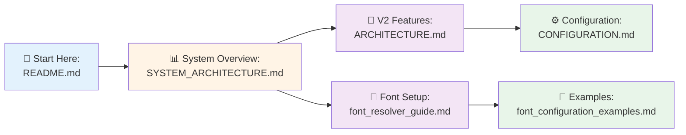

# LangFlix Documentation

> **Version 2.0** - Dual-Language Architecture with Visual Guides

## 📚 Quick Links

### 🎯 Core Documentation

| Document | Description |
|----------|-------------|
| **[SYSTEM_ARCHITECTURE.md](./SYSTEM_ARCHITECTURE.md)** | 📊 **Visual system architecture with diagrams** |
| [ARCHITECTURE.md](./ARCHITECTURE.md) | V2 system design with dual-language subtitle support |
| [CONFIGURATION.md](./CONFIGURATION.md) | Configuration settings for V2 features |
| [FEATURE_GLOSSARY.md](./FEATURE_GLOSSARY.md) | Standard terminology for V2 components |

### 🎨 Component Guides

| Document | Description |
|----------|-------------|
| **[QUICK_REFERENCE.md](./QUICK_REFERENCE.md)** | 🚀 **Visual workflows & quick commands** |
| [font_resolver_guide.md](./font_resolver_guide.md) | FontResolver API reference & usage patterns |
| [font_configuration_examples.md](./font_configuration_examples.md) | Real-world font configuration examples |
| [V2_PROMPT_REQUIREMENTS.md](./V2_PROMPT_REQUIREMENTS.md) | LLM prompt specifications |

### 📂 Archives

| Document | Description |
|----------|-------------|
| [v1/](./v1/) | Archived V1 documentation |

## What's New in V2

### Dual-Language Subtitle Architecture
V2 introduces a fundamentally new approach to language learning content:

| Feature | V1 | V2 |
|---------|----|----|
| Subtitle Source | Single file, LLM translates | Dual files from Netflix |
| Translation | LLM generates on-the-fly | Pre-existing professional translations |
| Token Usage | ~1000 tokens/expression | ~300 tokens/expression (70% reduction) |
| Font Support | Single language | Dual-font for mixed content |

### Key V2 Components

1. **DualSubtitleService** - Loads and aligns source + target subtitle pairs
2. **V2ContentAnalyzer** - Index-based content selection (no translation)
3. **Netflix Folder Detection** - Auto-discovers subtitle files from Netflix downloads
4. **Dual-Font Rendering** - Correct fonts for Korean←→Spanish, etc.

## Getting Started

```bash
# Enable V2 mode in config
dual_language:
  enabled: true
  source_language: "English"
  target_language: "Korean"
```

## 📊 Visual Overview

Want to understand the system quickly? Start with the **[Visual System Architecture](./SYSTEM_ARCHITECTURE.md)**!

### What You'll Find

The visual architecture guide includes:
- 🏗️ **High-level architecture** with component layers
- 🔄 **Complete workflow sequences** for video generation
- 📊 **Data flow diagrams** showing how information moves through the system
- 🎬 **Video processing pipelines** (long-form & short-form)
- 🔌 **Component interaction diagrams**
- 🛠️ **Technology stack visualization**
- ⚡ **Performance & caching strategies**
- 🌍 **Deployment architecture**

### Quick Navigation



## Directory Structure

```
docs/
├── README.md                        # 📖 This file - documentation index
├── SYSTEM_ARCHITECTURE.md           # 📊 NEW: Visual system architecture with diagrams
├── QUICK_REFERENCE.md               # 🚀 NEW: Visual workflows & quick commands
├── ARCHITECTURE.md                  # 🔧 V2 dual-language system design
├── CONFIGURATION.md                 # ⚙️ V2 configuration settings
├── FEATURE_GLOSSARY.md              # 📚 V2 terminology reference
├── V2_PROMPT_REQUIREMENTS.md        # 🤖 LLM prompt specifications
├── font_resolver_guide.md           # 🎨 NEW: FontResolver API & usage
├── font_configuration_examples.md   # 📝 NEW: Font configuration examples
└── v1/                              # 📂 Archived V1 documentation
    ├── API.md
    ├── ARCHITECTURE.md
    ├── CLI_REFERENCE.md
    └── ...
```
