# LangFlix Documentation

> Language Learning Video Generation Platform

## 📚 Quick Links

### 🎯 Core Documentation

| Document                                               | Description                                       |
| ------------------------------------------------------ | ------------------------------------------------- |
| **[SYSTEM_ARCHITECTURE.md](./SYSTEM_ARCHITECTURE.md)** | 📊 **Visual system architecture with diagrams**   |
| [ARCHITECTURE.md](./ARCHITECTURE.md)                   | System design with dual-language subtitle support |
| [CONFIGURATION.md](./CONFIGURATION.md)                 | Configuration settings                            |
| [FEATURE_GLOSSARY.md](./FEATURE_GLOSSARY.md)           | Standard terminology                              |
| [PIPELINE_ARCHITECTURE.md](./PIPELINE_ARCHITECTURE.md) | Contextual localization pipeline                  |

### 🎨 Component Guides

| Document                                                           | Description                                 |
| ------------------------------------------------------------------ | ------------------------------------------- |
| **[QUICK_REFERENCE.md](./QUICK_REFERENCE.md)**                     | 🚀 **Visual workflows & quick commands**    |
| [font_resolver_guide.md](./font_resolver_guide.md)                 | FontResolver API reference & usage patterns |
| [font_configuration_examples.md](./font_configuration_examples.md) | Real-world font configuration examples      |

### 📂 Archives

| Document               | Description              |
| ---------------------- | ------------------------ |
| [archive/](./archive/) | Historical documentation |

## Key Features

### Dual-Language Subtitle Architecture

LangFlix uses a dual-language subtitle approach for language learning content:

| Feature           | Description                                              |
| ----------------- | -------------------------------------------------------- |
| Subtitle Source   | Dual files from Netflix-style folders                    |
| Translation       | Pre-existing professional translations + AI localization |
| Font Support      | Dual-font rendering for mixed content                    |
| Context Awareness | Show Bible + Episode summaries for accurate translations |

### Core Components

1. **DualSubtitleService** - Loads and aligns source + target subtitle pairs
2. **ContentAnalyzer** - Index-based content selection
3. **Netflix Folder Detection** - Auto-discovers subtitle files
4. **Dual-Font Rendering** - Correct fonts for Korean↔Spanish, etc.
5. **Pipeline** - Contextual localization with Show Bible integration

## Getting Started

```bash
# Enable dual-language mode in config
dual_language:
  enabled: true
  source_language: "English"
  target_language: "Korean"
```

### Quick Test (No UI Required)

```bash
# Run quick test with default settings (Korean → Spanish, English)
python scripts/test_quick.py

# Custom source/target languages
python scripts/test_quick.py --source ko --target es,en

# Dry run (analysis only, no video creation)
python scripts/test_quick.py --dry-run

# Skip short video creation
python scripts/test_quick.py --no-shorts
```

## 📊 Visual Overview

Want to understand the system quickly? Start with the **[Visual System Architecture](./SYSTEM_ARCHITECTURE.md)**!

### What You'll Find

The visual architecture guide includes:

- 🏗️ **High-level architecture** with component layers
- 🔄 **Complete workflow sequences** for video generation
- 📊 **Data flow diagrams** showing how information moves through the system
- 🎬 **Video processing pipelines** (long-form & short-form)
- 🔌 **Component interaction diagrams**
- 🛠️ **Technology stack visualization**
- ⚡ **Performance & caching strategies**
- 🌍 **Deployment architecture**

### Quick Navigation

```mermaid
graph LR
    A[📖 Start Here:<br/>README.md] --> B[📊 System Overview:<br/>SYSTEM_ARCHITECTURE.md]
    B --> C[🔧 Architecture:<br/>ARCHITECTURE.md]
    B --> D[🎨 Font Setup:<br/>font_resolver_guide.md]
    C --> E[⚙️ Configuration:<br/>CONFIGURATION.md]
    D --> F[📝 Examples:<br/>font_configuration_examples.md]

    style A fill:#e3f2fd
    style B fill:#fff4e6
    style C fill:#f3e5f5
    style D fill:#f3e5f5
    style E fill:#e8f5e9
    style F fill:#e8f5e9
```



## Directory Structure

```
docs/
├── README.md                        # 📖 This file - documentation index
├── SYSTEM_ARCHITECTURE.md           # 📊 Visual system architecture with diagrams
├── QUICK_REFERENCE.md               # 🚀 Visual workflows & quick commands
├── ARCHITECTURE.md                  # 🔧 Dual-language system design
├── CONFIGURATION.md                 # ⚙️ Configuration settings
├── FEATURE_GLOSSARY.md              # 📚 Terminology reference
├── PIPELINE_ARCHITECTURE.md         # 🔄 Contextual localization pipeline
├── font_resolver_guide.md           # 🎨 FontResolver API & usage
├── font_configuration_examples.md   # 📝 Font configuration examples
└── archive/                         # 📂 Historical documentation
```
