# LangFlix System Architecture - Visual Guide

> **Comprehensive visual documentation of LangFlix's architecture, components, and data flows**

## 📋 Table of Contents
- [System Overview](#system-overview)
- [High-Level Architecture](#high-level-architecture)
- [Core Components](#core-components)
- [Video Processing Pipeline](#video-processing-pipeline)
- [Data Flow Diagrams](#data-flow-diagrams)
- [Component Interactions](#component-interactions)
- [Technology Stack](#technology-stack)

---

## System Overview

LangFlix is an AI-powered educational video generation platform that transforms TV show episodes into language learning content.

### What LangFlix Does

```mermaid
graph LR
    A[📺 TV Show<br/>Episode] -->|Analyzes| B[🤖 AI<br/>Expression<br/>Selection]
    B -->|Generates| C[🎬 Educational<br/>Videos]
    C -->|Uploads| D[📱 YouTube<br/>Shorts/Videos]

    style A fill:#e1f5ff
    style B fill:#fff4e6
    style C fill:#f3e5f5
    style D fill:#e8f5e9
```

### Key Features

- **Dual-Language Support**: Uses professional Netflix subtitles (no LLM translation needed)
- **Multi-Format Output**: Long-form (16:9) and short-form (9:16) videos
- **AI-Powered Selection**: LLM identifies valuable learning expressions
- **Automated Workflow**: End-to-end pipeline from subtitle to YouTube
- **Font Management**: Multi-language font resolution for overlays

---

## High-Level Architecture

### System Layers

---

## Core Components

### Component Hierarchy & Responsibilities

```mermaid
graph TB
    subgraph "VideoEditor (2,443 lines) - Coordinator"
        VE[VideoEditor<br/>🎯 Orchestrates video generation<br/>📝 Manages temp files<br/>🔧 Configures components]
    end

    subgraph "Video Processing Components"
        SFC[ShortFormCreator<br/>603 lines<br/>📱 9:16 vertical videos<br/>⚖️ Scale & pad<br/>🎨 Overlay coordination]

        OR[OverlayRenderer<br/>765 lines<br/>✏️ Title overlay<br/>🏷️ Keywords<br/>📚 Vocabulary<br/>💬 Narrations<br/>🗣️ Expressions]

        VC[VideoComposer<br/>276 lines<br/>🔗 Concatenation<br/>✂️ Clip extraction<br/>🎞️ Video combination]

        FR[FontResolver<br/>320 lines<br/>🔤 Font management<br/>🌍 Multi-language<br/>💾 Caching]
    end

    subgraph "Utilities"
        PR[PathResolver<br/>435 lines<br/>📁 Directory structure<br/>🗂️ Path generation<br/>🧹 Cleanup]

        TFM[TempFileManager<br/>🗑️ Temp tracking<br/>♻️ Auto cleanup]

        CM[CacheManager<br/>💾 TTS cache<br/>📊 Data cache]
    end

    subgraph "External Tools"
        FF[FFmpeg<br/>🎬 Video processing<br/>🔊 Audio mixing<br/>✏️ Text rendering]

        TTS[TTS APIs<br/>🗣️ Speech synthesis<br/>🎵 Voice generation]
    end

    VE -->|delegates to| SFC
    VE -->|uses| VC
    VE -->|uses| PR
    VE -->|uses| TFM
    VE -->|uses| CM
    VE -->|uses| FR

    SFC -->|renders via| OR
    SFC -->|calls| FF
    OR -->|resolves fonts| FR
    OR -->|draws text| FF
    VC -->|processes| FF

    VE -->|generates audio| TTS

    style VE fill:#e3f2fd
    style SFC fill:#e8f5e9
    style OR fill:#e8f5e9
    style VC fill:#e8f5e9
    style FR fill:#e8f5e9
    style PR fill:#fff3e0
    style TFM fill:#fff3e0
    style CM fill:#fff3e0
    style FF fill:#ffebee
    style TTS fill:#ffebee
```

### Component Metrics

| Component | Lines | Tests | Responsibility |
|-----------|-------|-------|----------------|
| VideoEditor | 2,443 | ✓ | Orchestrate video generation |
| ShortFormCreator | 603 | 22 | Create 9:16 vertical videos |
| OverlayRenderer | 765 | 27 | Render text overlays |
| VideoComposer | 276 | 16 | Compose video clips |
| FontResolver | 320 | 23 | Manage multi-language fonts |
| PathResolver | 435 | 33 | Manage directory structure |

---

## Video Processing Pipeline

### Complete Workflow Sequence

###Long-Form Video Creation Flow

```mermaid
flowchart TD
    A[Expression Data] --> B[📊 Extract Context Clip]
    B --> |context_start → context_end| C

    C[🔄 Repeat Expression 3x] --> D[➕ Add Transitions]
    D --> E[📚 Create Educational Slide]

    subgraph "Educational Slide Generation"
        E1[🖼️ Background Image] --> E2[✏️ Add Text Overlays<br/>Expression + Translation]
        E2 --> E3[🗣️ Generate TTS Audio<br/>or Extract Original]
        E3 --> E4[🎵 Sync Audio + Video]
    end

    E --> E1
    E4 --> F[🔗 Concatenate All Clips]
    F --> G[🎨 Add Logo Overlay]
    G --> H[✅ Long-Form Video<br/>1920x1080 16:9]

    style A fill:#e1f5ff
    style B fill:#fff4e6
    style C fill:#fff4e6
    style E fill:#f3e5f5
    style E1 fill:#fce4ec
    style E2 fill:#fce4ec
    style E3 fill:#fce4ec
    style E4 fill:#fce4ec
    style H fill:#e8f5e9
```

### Short-Form Video Creation Flow

```mermaid
flowchart TD
    A[📺 Long-Form Video<br/>1920x1080] --> B[⚖️ Scale & Pad]

    B --> C{🎨 Layout Structure<br/>1080x1920}

    C -->|Top 440px| T[⬛ Black Padding]
    C -->|Center 1040px| M[🎬 Video Content]
    C -->|Bottom 440px| B1[⬛ Black Padding]

    T --> D1[📌 Viral Title Overlay]
    D1 --> D2[🏷️ Catchy Keywords]

    M --> D3[👁️ Original Video<br/>with subtitles]

    B1 --> D4[🗣️ Expression Text<br/>Source Language]
    D4 --> D5[📖 Translation Text<br/>Target Language]

    D2 --> E[✨ Dynamic Overlays]
    D3 --> E
    D5 --> E

    E --> F1[📚 Vocabulary Annotations<br/>Timed appearance]
    E --> F2[💭 Narration Bubbles<br/>Commentary]
    E --> F3[🗣️ Expression Annotations<br/>Idioms & phrases]

    F1 --> G[🎨 Add Logo<br/>Top center]
    F2 --> G
    F3 --> G

    G --> H[📝 Embed Subtitles<br/>Dialogue layer]
    H --> I[✅ Short-Form Video<br/>1080x1920 9:16]

    style A fill:#e1f5ff
    style B fill:#fff4e6
    style C fill:#fff3e0
    style E fill:#f3e5f5
    style F1 fill:#fce4ec
    style F2 fill:#fce4ec
    style F3 fill:#fce4ec
    style I fill:#e8f5e9
```

---

## Data Flow Diagrams

### Expression Analysis Flow (Dual-Language)

```mermaid
flowchart TB
    A[📺 Video File<br/>S01E01.mp4] --> B[📁 Netflix Subtitle Folder<br/>S01E01/]

    B --> C1[🇰🇷 Korean.srt<br/>Source Language]
    B --> C2[🇪🇸 Spanish.srt<br/>Target Language]

    C1 --> D[🔄 DualSubtitleService]
    C2 --> D

    D --> E[📊 Align Subtitles<br/>by timestamp]

    E --> F[🤖 Expression Analyzer<br/>LLM]

    F --> G{✨ AI Analysis}

    G -->|Identifies| H1[💡 Expression Indices<br/>e.g., dialogue #5, #12]
    G -->|Evaluates| H2[📈 Learning Value<br/>Frequency, Context]
    G -->|Checks| H3[✅ Has Timestamps]

    H1 --> I[🔍 ExpressionSelector]
    H2 --> I
    H3 --> I

    I --> J{🎯 Filter Criteria}

    J -->|✓ Valid timestamps| K[Selected Expressions]
    J -->|✓ Rich context| K
    J -->|✓ Learning value| K
    J -->|✗ Invalid| L[❌ Discard]

    K --> M[📦 ExpressionAnalysis<br/>Objects]

    M --> N[🎬 Video Generation]

    style A fill:#e1f5ff
    style D fill:#fff4e6
    style F fill:#f3e5f5
    style G fill:#ffebee
    style M fill:#e8f5e9
    style N fill:#e8f5e9
```

### Directory Structure & File Management

```mermaid
graph TB
    subgraph "🗂️ Workspace Root"
        ROOT[workspace/]
    end

    ROOT --> LANG[📁 korean/<br/>Language Directory]

    LANG --> D1[📁 long_form_videos/<br/>16:9 videos]
    LANG --> D2[📁 shorts/<br/>9:16 videos]
    LANG --> D3[📁 expressions/<br/>Expression clips]
    LANG --> D4[📁 subtitles/<br/>SRT files]
    LANG --> D5[📁 tts_audio/<br/>TTS cache]
    LANG --> D6[📁 videos/<br/>Source videos]

    D1 --> F1[01_expression.mkv<br/>02_expression.mkv<br/>03_expression.mkv]

    D2 --> F2[short_form_01_expression.mkv<br/>short_form_02_expression.mkv<br/>short_form_03_expression.mkv]

    D3 --> F3[expression_01.srt<br/>expression_02.srt]

    D4 --> F4[S01E01.ko.srt<br/>S01E01.es.srt]

    D5 --> F5[expression_01_tts.wav<br/>expression_02_tts.wav]

    D6 --> F6[S01E01.mp4<br/>S01E02.mp4]

    PR[🛠️ PathResolver]
    PR -.manages.-> D1
    PR -.manages.-> D2
    PR -.manages.-> D3
    PR -.manages.-> D4
    PR -.manages.-> D5
    PR -.manages.-> D6

    style ROOT fill:#e3f2fd
    style LANG fill:#fff3e0
    style D1 fill:#e8f5e9
    style D2 fill:#e8f5e9
    style D3 fill:#fff4e6
    style D4 fill:#fff4e6
    style D5 fill:#fce4ec
    style D6 fill:#fce4ec
    style PR fill:#ffebee
```

### Complete Pipeline Data Flow

```mermaid
flowchart LR
    subgraph "📥 Input"
        I1[📺 TV Show Video]
        I2[📝 Source Subtitles<br/>Korean]
        I3[📝 Target Subtitles<br/>Spanish]
        I4[ℹ️ Episode Info<br/>S01E01]
    end

    subgraph "🔍 Analysis"
        A1[SubtitleParser]
        A2[ExpressionAnalyzer<br/>+ LLM]
        A3[ExpressionSelector]
    end

    subgraph "⚙️ Processing"
        P1[VideoProcessor<br/>Clip Extraction]
        P2[VideoEditor<br/>Long-form]
        P3[ShortFormCreator<br/>9:16]
    end

    subgraph "📤 Output"
        O1[🎬 Long-Form Videos]
        O2[📱 Short-Form Videos]
        O3[🖼️ Thumbnails]
        O4[📊 Metadata JSON]
    end

    subgraph "☁️ Upload"
        U1[YouTube Upload]
        U2[Database Storage]
    end

    I1 --> P1
    I2 --> A1
    I3 --> A1
    I4 --> A1

    A1 --> A2
    A2 --> A3
    A3 --> P1

    P1 --> P2
    P2 --> O1
    O1 --> P3
    P3 --> O2

    P2 --> O3
    P2 --> O4

    O1 --> U1
    O2 --> U1
    O3 --> U1
    O4 --> U2

    U1 --> U2

    style I1 fill:#e1f5ff
    style I2 fill:#e1f5ff
    style I3 fill:#e1f5ff
    style A2 fill:#fff4e6
    style P2 fill:#f3e5f5
    style P3 fill:#f3e5f5
    style O1 fill:#e8f5e9
    style O2 fill:#e8f5e9
    style U1 fill:#fff3e0
    style U2 fill:#fff3e0
```

---

## Component Interactions

### ShortFormCreator & OverlayRenderer Workflow

### Font Resolution Flow

```mermaid
flowchart TD
    A[🔤 Request Font] --> B{Language?}

    B -->|Source<br/>Korean| C1[get_source_font]
    B -->|Target<br/>Spanish| C2[get_target_font]
    B -->|Both| C3[get_dual_fonts]

    C1 --> D[💾 FontResolver Cache]
    C2 --> D
    C3 --> D

    D --> E{Cache Hit?}

    E -->|✅ Yes| F[Return Cached Font]
    E -->|❌ No| G[🔍 Query font_utils]

    G --> H{File Exists?}
    H -->|✅ Yes| I[💾 Cache & Return]
    H -->|❌ No| J[Return None]

    F --> K[✏️ FFmpeg drawtext]
    I --> K
    J --> L[🔄 Use System Default]
    L --> K

    K --> M[✅ Rendered Text]

    style A fill:#e1f5ff
    style D fill:#fff4e6
    style E fill:#f3e5f5
    style K fill:#e8f5e9
    style M fill:#e8f5e9
```

### Path Resolution Pattern

```mermaid
flowchart LR
    A[Need Path] --> B[🗂️ PathResolver]

    B --> C{Path Type?}

    C -->|Shorts| D1[get_shorts_dir]
    C -->|Subtitles| D2[get_subtitles_dir]
    C -->|TTS Audio| D3[get_tts_audio_dir]
    C -->|Temp File| D4[get_temp_path]
    C -->|Long-form| D5[get_long_form_path]

    D1 --> E1[📁 language_dir/shorts/]
    D2 --> E2[📁 language_dir/subtitles/]
    D3 --> E3[📁 language_dir/tts_audio/]
    D4 --> E4[📁 output_dir/temp_*.mkv]
    D5 --> E5[📁 output_dir/01_expr.mkv]

    E1 --> F{Create if<br/>Needed?}
    E2 --> F
    E3 --> F
    E4 --> F
    E5 --> F

    F -->|✅ Yes| G[mkdir -p]
    F -->|❌ No| H[Return Path]

    G --> H
    H --> I[✅ Path Object]

    style B fill:#fff4e6
    style F fill:#f3e5f5
    style I fill:#e8f5e9
```

---

## Technology Stack

### Core Technologies

### Technology Choices & Rationale

| Technology | Purpose | Why Chosen |
|------------|---------|------------|
| **Python 3.12** | Backend language | Rich ecosystem, AI/ML libraries |
| **FFmpeg** | Video processing | Industry standard, powerful |
| **Google Gemini** | Expression analysis | Fast, cost-effective, good accuracy |
| **OpenAI TTS** | Speech synthesis | Natural voices, reliable |
| **PostgreSQL** | Database | ACID compliance, JSON support |
| **Redis** | Caching | Fast, distributed cache |
| **Flask** | Web UI | Lightweight, easy to extend |
| **FastAPI** | REST API | Modern, async, auto docs |

---

## Performance & Optimization

### Caching Strategy

```mermaid
flowchart TD
    A[📥 Request] --> B{💾 Cache Check}

    B -->|✅ Hit| C[📤 Return Cached Data]
    B -->|❌ Miss| D[⚙️ Process Request]

    D --> E{🔖 Cache Type?}

    E -->|TTS Audio| F1[CacheManager<br/>Disk Cache]
    E -->|Font Paths| F2[FontResolver<br/>Memory Cache]
    E -->|Expression Data| F3[Redis<br/>Distributed Cache]
    E -->|Video Metadata| F4[PostgreSQL<br/>Database Cache]

    F1 --> G1[💾 Save to Disk<br/>.wav files]
    F2 --> G2[💾 Save to Memory<br/>Dict]
    F3 --> G3[💾 Save to Redis<br/>Key-Value]
    F4 --> G4[💾 Save to DB<br/>Table]

    G1 --> H[📤 Return Result]
    G2 --> H
    G3 --> H
    G4 --> H

    C --> I[✅ Fast Response]
    H --> J[✅ Slower Response<br/>Cache Populated]

    style B fill:#fff4e6
    style C fill:#e8f5e9
    style F1 fill:#fce4ec
    style F2 fill:#fce4ec
    style F3 fill:#fce4ec
    style F4 fill:#fce4ec
```

### Parallel Processing

```mermaid
flowchart LR
    A[📋 Expression List<br/>10 expressions] --> B[🔀 ParallelProcessor]

    B --> C1[⚙️ Worker 1<br/>Expression 1-2]
    B --> C2[⚙️ Worker 2<br/>Expression 3-4]
    B --> C3[⚙️ Worker 3<br/>Expression 5-6]
    B --> C4[⚙️ Worker 4<br/>Expression 7-8]
    B --> C5[⚙️ Worker 5<br/>Expression 9-10]

    C1 --> D[🎬 VideoEditor]
    C2 --> D
    C3 --> D
    C4 --> D
    C5 --> D

    D --> E1[✅ Video 1-2]
    D --> E2[✅ Video 3-4]
    D --> E3[✅ Video 5-6]
    D --> E4[✅ Video 7-8]
    D --> E5[✅ Video 9-10]

    E1 --> F[📦 Collect Results]
    E2 --> F
    E3 --> F
    E4 --> F
    E5 --> F

    F --> G[✅ All Videos Complete<br/>5x Faster]

    style B fill:#fff4e6
    style D fill:#f3e5f5
    style F fill:#e8f5e9
    style G fill:#e8f5e9
```

---

## Error Handling & Resilience

### Error Flow with Retry Logic

```mermaid
flowchart TD
    A[⚙️ Operation Start] --> B{Try Execute}

    B -->|✅ Success| C[Continue Pipeline]
    B -->|❌ Error| D[Catch Exception]

    D --> E{Error Type?}

    E -->|Retryable<br/>Network, Timeout| F[🔄 Retry Logic]
    E -->|Fatal<br/>Invalid Data| G[❌ Error Handler]

    F --> H{Retry Count?}
    H -->|< Max Retries<br/>3 attempts| I[⏱️ Exponential Backoff]
    H -->|>= Max Retries| G

    I --> B

    G --> J[📝 Log Error<br/>+ Context]
    J --> K{Fallback Available?}

    K -->|✅ Yes| L[🔄 Use Fallback<br/>e.g., Default font]
    K -->|❌ No| M[❌ Raise Exception]

    L --> C
    M --> N[🛑 Pipeline Failed]

    C --> O[🧹 Cleanup<br/>Temp files]
    N --> O

    O --> P[✅ Complete]

    style A fill:#e1f5ff
    style B fill:#fff4e6
    style E fill:#f3e5f5
    style G fill:#ffebee
    style O fill:#fff3e0
    style P fill:#e8f5e9
```

---

## Deployment Architecture

### Production Environment

```mermaid
graph TB
    subgraph "🌍 Internet"
        U1[👤 Web Browser]
        U2[🖥️ CLI Client]
        U3[📱 API Client]
    end

    subgraph "⚖️ Load Balancer"
        LB[Nginx<br/>SSL Termination<br/>Rate Limiting]
    end

    subgraph "🎨 Application Tier"
        A1[Flask App 1<br/>Dashboard]
        A2[Flask App 2<br/>Dashboard]
        A3[FastAPI<br/>REST API]
    end

    subgraph "⚙️ Worker Tier"
        W1[Celery Worker 1<br/>Video Processing]
        W2[Celery Worker 2<br/>Expression Analysis]
        W3[Celery Worker 3<br/>Upload Tasks]
        W4[Celery Worker N<br/>...]
    end

    subgraph "💾 Data Tier"
        DB[(PostgreSQL<br/>Primary)]
        DBRO[(PostgreSQL<br/>Read Replica)]
        REDIS[(Redis<br/>Cache + Queue)]
        FS[File Storage<br/>NFS/S3]
    end

    subgraph "☁️ External Services"
        E1[YouTube API]
        E2[Google Gemini]
        E3[OpenAI APIs]
        E4[ElevenLabs]
    end

    U1 --> LB
    U2 --> LB
    U3 --> LB

    LB --> A1
    LB --> A2
    LB --> A3

    A1 --> REDIS
    A2 --> REDIS
    A3 --> REDIS

    A1 --> W1
    A2 --> W2
    A3 --> W3

    W1 --> DB
    W2 --> DB
    W3 --> DB
    W4 --> DB

    W1 --> REDIS
    W2 --> REDIS
    W3 --> REDIS
    W4 --> REDIS

    A1 --> DBRO
    A2 --> DBRO
    A3 --> DBRO

    W1 --> FS
    W2 --> FS
    W3 --> FS
    W4 --> FS

    W1 --> E1
    W2 --> E2
    W3 --> E3
    W4 --> E4

    style LB fill:#e3f2fd
    style A1 fill:#fff3e0
    style A2 fill:#fff3e0
    style A3 fill:#fff3e0
    style W1 fill:#f3e5f5
    style W2 fill:#f3e5f5
    style W3 fill:#f3e5f5
    style W4 fill:#f3e5f5
    style DB fill:#e8f5e9
    style REDIS fill:#e8f5e9
    style FS fill:#e8f5e9
```

---

## Summary

### Key Architectural Principles

1. **🎯 Separation of Concerns**: Clear boundaries between layers (Presentation, Service, Core, Utilities)
2. **🔄 Delegation Pattern**: VideoEditor delegates to specialized components (ShortFormCreator, OverlayRenderer)
3. **🛠️ Centralized Utilities**: PathResolver, FontResolver, CacheManager handle cross-cutting concerns
4. **⚡ Performance Optimization**: Multi-level caching (Memory, Disk, Redis) and parallel processing
5. **🔐 Resilience**: Comprehensive error handling with retry logic and fallbacks
6. **🌍 Multi-Language Support**: Dual-language architecture with professional subtitle integration

### Refactoring Impact

**Before Phase 1:**
- VideoEditor: 3,428 lines
- Largest method: 1,023 lines
- Methods >500 lines: 1

**After Phase 1:**
- VideoEditor: 2,443 lines (-28%)
- Largest method: 489 lines (-52%)
- Methods >500 lines: 0 (-100%)
- New utilities: PathResolver (435 lines), integrated ShortFormCreator
- Test coverage: +33 tests (PathResolver)

### Component Statistics

| Component | Lines | Tests | Coverage |
|-----------|-------|-------|----------|
| VideoEditor | 2,443 | ✓ | Core coordinator |
| ShortFormCreator | 603 | 22 | 9:16 videos |
| OverlayRenderer | 765 | 27 | Text overlays |
| VideoComposer | 276 | 16 | Clip composition |
| FontResolver | 320 | 23 | Font management |
| PathResolver | 435 | 33 | Path management |
| **Total** | **4,842** | **121** | **Modular** |

---

## Related Documentation

- [ARCHITECTURE.md](./ARCHITECTURE.md) - Dual-Language Architecture
- [font_resolver_guide.md](./font_resolver_guide.md) - FontResolver API & Usage
- [font_configuration_examples.md](./font_configuration_examples.md) - Font Configuration Examples
- [archive/LEGACY_PROMPT_REQUIREMENTS.md](./archive/LEGACY_PROMPT_REQUIREMENTS.md) - Historical LLM Prompt Specifications
- [FEATURE_GLOSSARY.md](./FEATURE_GLOSSARY.md) - Standard Terminology

---

**Last Updated**: 2025-12-16
**Version**: 2.0 (Post Phase 1 Refactoring)
**Status**: ✅ Production Ready
