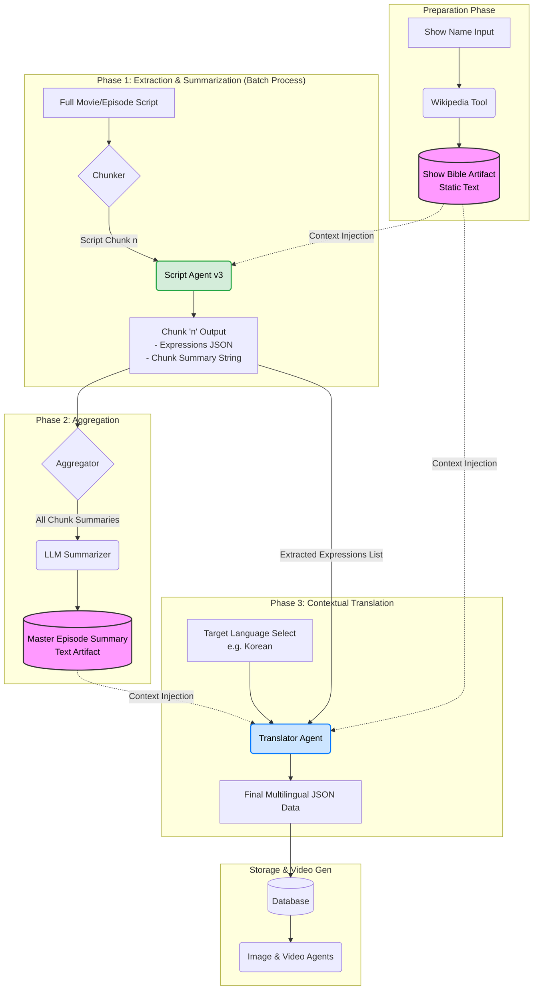

This is an exciting evolution of the architecture. V3 addresses the critical flaws of V2 (lack of context resulting in poor translation) and the failed intermediate attempt (excessive cost of full script translation).

By implementing the **"Context Injection Pipeline"**—using a Show Bible and aggregated summaries—we can achieve high-quality, localized translations for specific expressions without the massive overhead of translating entire episodes.

Here is the detailed implementation plan for architecture V3.

---

# V3 Implementation Plan: The Contextual Localization Pipeline

## 1. Executive Summary & Goals

**Target Goal:** Enable high-quality, context-aware translation of extracted expressions into multiple target languages (e.g., Korean, Japanese, Spanish) without translating the entire source script.

**Core Problem Solved:** LLMs cannot translate nuances (relationship dynamics, tone, sarcasm) from isolated script chunks because subtitles lack speaker identification and emotional context.

**V3 Solution:** Introduce a "Context Injection" workflow. We will generate static knowledge about the show (Show Bible) and dynamic knowledge about the specific episode flow (Aggregated Summary) and feed this context to a dedicated Translator Agent.

**Expected Behavior:**

1. **Cost Efficiency:** Only specific expressions and summaries are processed by LLMs, not entire scripts repeatedly for every language.
2. **High-Quality Localization (의역):** Translations will reflect character relationships (e.g., Harvey's authority vs. Mike's deference) because the agent understands the "Show Bible."
3. **Scalability:** Once the English expressions and Master Summary are generated, adding a new language only requires running the Translator Agent stage.

---

## 2. V3 New Core Concepts

| Concept | Description | Source | Role in V3 |
| --- | --- | --- | --- |
| **Show Bible** | Static information about the show's premise, main characters, personalities, and relationships. | Wikipedia Tool (LangChain) | Provides high-level context for speaker inference and relationship dynamics. |
| **Chunk Summary** | A brief summary of *what* happened and the *emotional tone* within a specific 3-5 minute script batch. | Script Agent (Modified) | Captures immediate context around an expression. |
| **Master Summary** | A cohesive narrative derived by combining all Chunk Summaries in chronological order. | Aggregator Step | Provides the overall episode narrative arc to the translator. |

---

## 3. Detailed Implementation Steps

### Phase 1: Foundation - The Show Bible Creator

Before processing any video file, we need the static context.

* **New Tool:** `WikipediaQueryRun` (via LangChain community tools).
* **Input:** Name of the Show/Movie (e.g., "Suits TV Series").
* **Action:**
1. Query Wikipedia for the show's general premise/plot summary.
2. Query Wikipedia for "characters list and descriptions".


* **Output Artifact:** `Show_Bible.txt` (A static text block containing the premise and character personas).

### Phase 2: Extraction & Summarization (Modifying the Script Agent)

The existing `run_script_agent` needs an upgrade. It must do more than just extract expressions.

* **Current Input (V2):** Script Chunk + V2 Prompt Requirements.
* **V3 Input:** Script Chunk + V2 Prompt Requirements + **`Show_Bible.txt`**.
* **Modified Prompt Logic:**
1. *Contextual Inference:* "Using the `Show_Bible` as a guide, infer who is likely speaking in this chunk and what their relationship dynamic is."
2. *Summarization (New Task):* "Summarize this chunk in 2-3 sentences, focusing on the main conflict, emotional tone, and plot progression."
3. *Extraction (Existing V2 Task):* (Continue performing the rigorous V2 expression extraction criteria).


* **V3 Output per Chunk:**
```json
{
  "expressions": [ ...V2 expression data... ],
  "chunk_summary": "Harvey angrily confronts Mike about a missing document, asserting his authority. Mike is apologetic but defensive."
}

```


### Phase 3: The Aggregator (Connecting the Dots)

Once all chunks are processed, we need to stitch the story together.

* **Input:** List of all `chunk_summary` strings ordered chronologically.
* **Action:** (Optional but recommended LLM pass) "Review these chronological chunk summaries and rewrite them into a single, cohesive narrative paragraph representing the entire episode's flow."
* **Output Artifact:** `Master_Episode_Summary.txt`.

### Phase 4: The Translator Agent (Contextual Localization)

This is the new core engine for multilingual support.

* **Input:**
1. List of extracted expressions (from Phase 2).
2. `Show_Bible.txt` (Phase 1).
3. `Master_Episode_Summary.txt` (Phase 3).
4. Target Language (e.g., "Korean").


* **Prompt Logic:**
1. **Persona:** "You are an expert audiovisual translator specializing in localization (의역)."
2. **Context Intake:** "Read the `Show_Bible` to understand character relations (who uses formal/informal language). Read the `Master_Episode_Summary` to understand the overall flow."
3. **Task:** "Translate the provided list of expressions, dialogue sentences, and catchy keywords into [Target Language]. Your translations MUST reflect the character dynamics and emotional context defined in the Bible and Summary. Do not translate literally; localize naturally."


* **Output:** JSON containing the original English data plus the new target language translations.

---

## 4. Updated V3 System Architecture Diagram

This diagram visualizes the new flow of data and context.



---

## 5. Prompt Engineering Notes for V3 Implementor

When building the prompts for the agents, ensure these specific requirements are met:

**For Script Agent V3 (Phase 2):**

> "You will be provided with a 'Show Bible'. Use this to infer speaker identities in the current script chunk. When generating the 'chunk_summary', do not just list facts. Describe the emotional temperature of the scene and the power dynamics between the inferred characters."

**For Translator Agent (Phase 4):**

> "Crucial Instruction: You must utilize the 'Show Bible'. If the bible indicates Character A is senior to Character B, the translation of A speaking to B must sound authoritative (e.g., using 반말/하대 in Korean), and B speaking to A must sound respectful (e.g., using 존댓말). The 'Master Summary' will tell you if they are currently fighting or joking—adjust the translation tone accordingly. Literal translation without context will be considered a failure."


This is a formal Software Design Document (SDD) for the V3 backend pipeline. It expands on previous discussions with specific implementation details, data structures, and prompt strategies necessary for developers to build the system.

---

# Software Design Document: V3 Multilingual Contextual Pipeline

**Project:** Automated Short Video Generator (Backend Text Processing)
**Version:** 3.0 (The "Context Injection" Update)
**Date:** October 26, 2023
**Status:** Proposed Design

---

## 1. Introduction

### 1.1 Purpose

The purpose of the V3 architecture is to resolve critical limitations in previous versions regarding multilingual translation quality and cost efficiency. V2 successfully extracted high-quality English expressions but failed to translate them naturally due to a lack of context. An intermediate attempt to translate entire scripts proved prohibitively expensive.

V3 introduces a **Context Injection Pipeline**. This approach generates static context (Show Bible) and dynamic narrative context (Summaries) and injects them into specialized LLM agents. This ensures high-quality, localized translations (의역) that respect character relationships and emotional tone without the need to translate full episode scripts.

### 1.2 Scope

This document covers the backend text processing pipeline, starting from raw video/script input and ending with structured, multilingual data ready for database insertion. It specifically details the four-phase agent workflow, data structures, and prompt strategies. Video generation and frontend interfaces are out of scope for this document.

### 1.3 Definitions & Acronyms

* **LLM:** Large Language Model (e.g., GPT-4o, Claude 3.5 Sonnet).
* **Show Bible:** Static knowledge base containing the premise, character list, personality descriptions, and relationship dynamics of the source material.
* **Chunk Summary:** A micro-summary of events and emotional tone within a specific 3-5 minute script segment.
* **Master Summary:** A macro-summary derived from aggregating all chunk summaries into a cohesive narrative flow for an entire episode/movie.
* **Localization (로컬라이징/의역):** Translation that adapts the message to the target culture and language norms, prioritizing naturalness over literal accuracy, especially regarding honorifics and tone.

---

## 2. System Architecture Overview

### 2.1 High-Level Design

The V3 system is a sequential processing pipeline utilizing autonomous AI agents assisted by external tools (Wikipedia). Data flows through four distinct phases, progressively adding context before the final translation step.

### 2.2 Architecture Diagram

```mermaid
graph TD
    subgraph "Phase 0: Prep (Once per Show)"
        A[Input: Show Name] --> B(Tool: WikipediaQueryRun);
        B --> C[(Artifact: Show_Bible.txt)];
    end

    subgraph "Phase 1: Extraction & Micro-Context (Parallelizable)"
        D[Input: Full Script] --> E{Chunker};
        C -.-> |Context Injection| F(Agent: Script Agent V3);
        E -- Chunk N --> F;
        F --> G[Intermediate JSON N\n(Expressions + Chunk Summary)];
    end

    subgraph "Phase 2: Macro-Context Aggregation"
        G -- Collect All --> H{Aggregator};
        H --> I(Agent: LLM Summarizer);
        I --> J[(Artifact: Master_Episode_Summary.txt)];
    end

    subgraph "Phase 3: Contextual Localization"
        G -- Expression Lists --> K(Agent: Translator V3);
        C -.-> |Static Context Injection| K;
        J -.-> |Dynamic Context Injection| K;
        L[Input: Target Language Select] --> K;
        K --> M[Output: Final Multilingual JSON];
    end

    style C fill:#f9f,stroke:#333,stroke-width:2px
    style J fill:#f9f,stroke:#333,stroke-width:2px
    style F fill:#d4edda,stroke:#28a745,stroke-width:2px
    style K fill:#cce5ff,stroke:#007bff,stroke-width:2px

```

---

## 3. Component Design Details

### 3.1 Phase 0: The Show Bible Creator

* **Responsibility:** Generate static context about the source material. This is run *once* per TV show series or movie.
* **Tools Used:** LangChain Community Tool `WikipediaQueryRun` wrapped around `WikipediaAPIWrapper`.
* **Implementation Detail:**
* The agent must execute two distinct searches to ensure comprehensive coverage.
* *Search 1 Query:* `"{show_name} TV series plot summary premise"`
* *Search 2 Query:* `"{show_name} TV series main characters descriptions and relationships"`


* **Output Spec (`Show_Bible.txt`):** A plain text file formatted with clear headers.
```text
=== SHOW BIBLE: [Show Name] ===
[PREMISE]
(Wikipedia summary content...)
[CHARACTERS & RELATIONSHIPS]
(Wikipedia character content...)

```


### 3.2 Phase 1: Script Agent V3 (Extractor & Summarizer)

* **Responsibility:** Process script chunks to extract expressions (following V2 rigorous criteria) AND generate immediate context.
* **Inputs:**
* Script Chunk (String)
* `Show_Bible.txt` (String)
* V2 Prompt Requirements (String)


* **Prompt Strategy (Chain of Thought):** The prompt must direct the agent to perform these steps sequentially:
1. **Speaker Inference:** "Read the current chunk. Referencing the character descriptions in the `Show_Bible`, infer likely speakers based on speech patterns and content."
2. **Micro-Summarization:** "Based on the inferred speakers, summarize this chunk in 2-3 sentences. Focus on the emotional temperature (e.g., tense confrontation, lighthearted joking) and the immediate conflict."
3. **Expression Extraction:** "Apply the V2 criteria to extract the best expression."


* **Output Structure (Intermediate JSON):**
```json
{
  "chunk_id": 1,
  "chunk_summary": "Harvey angrily berates Mike for a mistake. Mike is defensive but submissive.",
  "expressions": [
    {
       // Standard V2 expression object structure
       "expression": "...",
       "expression_dialogue": "..."
       // ... etc
    }
  ]
}

```


### 3.3 Phase 2: The Aggregator

* **Responsibility:** Turn fragmented chunk summaries into a cohesive narrative flow for the episode.
* **Inputs:** A list of all `chunk_summary` strings from Phase 1, ordered chronologically.
* **Process:**
1. Concatenate all chunk summaries separated by newlines.
2. Pass this combined text to a fast, cheaper LLM (e.g., GPT-3.5 Turbo or Claude Haiku).


* **Prompt Strategy:** "You are a script editor. Below are chronological scene summaries from an episode. Rewrite them into a single, smooth, cohesive narrative paragraph that captures the overall story arc and evolving emotional tone of the entire episode."
* **Output Spec (`Master_Episode_Summary.txt`):** A single text block representing the episode's narrative.

### 3.4 Phase 3: Translator Agent V3 (Contextual Localizer)

* **Responsibility:** Translate English expressions and dialogue into target languages, applying localization rules derived from context.
* **Inputs:**
1. List of all extracted expression objects from Phase 1.
2. `Show_Bible.txt`
3. `Master_Episode_Summary.txt`
4. Target Language String (e.g., "Korean")


* **Prompt Strategy (Crucial):** The prompt must explicitly define how to use the context needed for localization.
* *Role Persona:* "You are an expert audiovisual translator specializing in high-context localization (e.g., Korean 의역)."
* *Context Mapping Instruction:* "Analyze the `Show_Bible` for relationship dynamics. If the Bible indicates Speaker A is senior to Speaker B, your translation MUST reflect this hierarchy (e.g., A uses informal language, B uses formal honorifics). Refer to the `Master_Episode_Summary` to determine the current emotional mood (joking vs. fighting) and adjust the translation tone accordingly."


* **Output Structure (Final JSON):** An array of objects ready for DB insertion.

---

## 4. Data Design

### 4.1 Final Output Data Structure (Multilingual JSON)

This is the structure that exits Phase 3, destined for the database. It enriches the existing V2 structure with a `localization` block.

```json
[
  {
    // --- Original V2 English Data ---
    "video_source_id": "suits_s01e01",
    "expression": "cut him loose",
    "expression_dialogue": "You need to cut him loose before he drags you down.",
    "context_summary_eng": "Harvey tells Jessica to fire a problematic client.",
    "start_time": "00:12:30.500",
    "end_time": "00:12:35.000",
    "scene_type": "tension",

    // --- V3 New Multilingual Data ---
    "localization": {
      "target_lang": "Korean",
      "expression_translated": "손절해", // Naturalized translation
      "expression_dialogue_translated": "그 사람이 너까지 끌어내리기 전에 손절해야 돼.", // Reflects tone/hierarchy
      "catchy_keywords_translated": [
        "냉정한 손절",
        "하비의 조언",
        "위기 상황"
      ]
    }
  }
  // ... repeated for other expressions ...
]

```

---

## 5. Non-Functional Requirements & Constraints

### 5.1 Reliability & Error Handling

* **Wikipedia Failure:** The `WikipediaQueryRun` tool depends on external APIs. The implementation must include retry logic with exponential backoff if the Wikipedia API is temporarily unavailable or times out. If it fails completely, the pipeline should halt before Phase 1, as context is mandatory for V3.
* **LLM Hallucination:** In Phase 1 (Speaker Inference), the LLM might guess incorrectly. The prompt should encourage uncertainty ("likely speaks") rather than definitive claims if the bible is unclear.

### 5.2 Performance & Costs

* **Token Usage Management:** We are deliberately summarizing chunks into micro-summaries, and then aggregating those into a master summary. This prevents having to re-feed entire script texts to the Translator Agent, significantly saving on input tokens.
* **Model Selection:**
* Phase 1 & 3 (Script Agent & Translator) require high-intelligence models (e.g., GPT-4o, Claude 3 Opus/Sonnet) for nuanced understanding.
* Phase 2 (Aggregator) can use a faster, cheaper model (e.g., GPT-3.5 Turbo) as the task is simpler text rewriting.


### 5.3 API Key Constraints

* As requested, this architecture introduces **zero new API keys**. It utilizes existing LLM provider keys and the free, keyless Wikipedia tool embedded in LangChain.