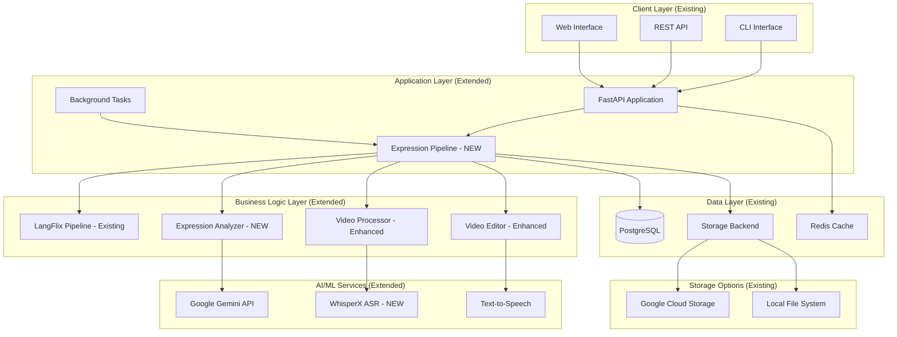

# LangFlix Development Plan: Expression-Based Learning Feature
## Solution Architecture & Development Roadmap

**Project**: LangFlix - Expression-Based Educational Video Generator  
**Director/Architect**: LangFlix Architecture Team  
**Date**: October 22, 2025  
**Version**: 2.0  
**Estimated Duration**: 6-8 weeks

---

## 📋 Executive Summary

### Project Goal
Implement an intelligent expression-based educational video generation system that:
- Automatically extracts key learning expressions from subtitled media using LLM (Gemini API)
- Precisely locates expression timestamps using WhisperX ASR
- Generates two video formats (landscape/portrait) with educational overlays
- Provides configurable styling and playback options
- Integrates seamlessly with existing LangFlix architecture

### Business Value
- **Enhanced Learning**: Focus on key expressions for faster language acquisition
- **Automated Content Creation**: Reduces manual video editing time by 90%
- **Multi-Format Output**: Supports both traditional and social media (shorts) formats
- **Scalable Architecture**: Handles multiple languages and media types
- **Storage Flexibility**: Supports both local and Google Cloud Storage backends

### Technical Complexity
- **High**: Integrates LLM, ASR (WhisperX), video processing, and subtitle manipulation
- **Dependencies**: Existing LangFlix pipeline, Gemini API, WhisperX, FFmpeg
- **Risk Level**: Medium (new integrations, performance optimization needed)
- **Architecture Alignment**: Builds on existing microservices architecture

---

## 🏗️ System Architecture Overview

### Integration with Existing LangFlix Architecture



### Data Flow Pipeline
```
Input: Media File + Subtitle File
    ↓
1. Subtitle Parser → Structured Text (Enhanced)
    ↓
2. LLM Expression Extractor → Key Expressions List (NEW - Gemini API)
    ↓
3. WhisperX ASR → Precise Timestamps (NEW)
    ↓
4. Media Slicer → Expression Video Segments (NEW)
    ↓
5. Educational Slide Generator → Visual Learning Content (NEW)
    ↓
6. Video Compositor → Two Output Formats (NEW)
    ↓
7. Storage Backend → Save to Local/GCS (Existing)
    ↓
Output: Landscape Video + Portrait/Shorts Video + Database Records
```

### Architecture Principles Alignment

Building on existing LangFlix principles:
1. **Microservices Architecture**: Add expression module as new service
2. **API-First Design**: RESTful endpoints for expression generation
3. **Event-Driven Processing**: Async background tasks via existing task queue
4. **Storage Abstraction**: Use existing StorageBackend interface
5. **AI/ML Integration**: Leverage existing Gemini client, add WhisperX

---

## 📅 Development Phases

## **PHASE 1: Foundation & Configuration Setup**
**Duration**: 1 week  
**Priority**: Critical  
**Dependencies**: None

### 1.1 Configuration System Enhancement

#### Integration with Existing Config System

**Files to Create/Modify**:
- `langflix/config/expression_config.py` (new)
- `langflix/config/__init__.py` (modify - add expression config imports)
- `tests/test_expression_config.py` (new)

#### Requirements

**R1.1.1 - Expression Configuration Module**
- [ ] Extend existing configuration system with expression settings
- [ ] Use existing YAML/JSON configuration infrastructure
- [ ] Follow existing configuration patterns from `langflix/config/`
- [ ] Integrate with existing PipelineConfig structure
- [ ] Add environment variable override support (existing pattern)

**R1.1.2 - Subtitle Styling Configuration**
```python
# langflix/config/expression_config.py
from dataclasses import dataclass
from typing import Optional
from langflix.config.base import BaseConfig

@dataclass
class SubtitleStylingConfig(BaseConfig):
    """Subtitle styling configuration for expressions"""
    default: dict = None
    expression_highlight: dict = None
    
    def __post_init__(self):
        self.default = self.default or {
            'color': '#FFFFFF',
            'font_family': 'Arial',
            'font_size': 24,
            'font_weight': 'normal',
            'background_color': '#000000',
            'background_opacity': 0.7,
            'position': 'bottom',
            'margin_bottom': 50
        }
        
        self.expression_highlight = self.expression_highlight or {
            'color': '#FFD700',  # Gold
            'font_weight': 'bold',
            'font_size': 28,
            'background_color': '#1A1A1A',
            'background_opacity': 0.85,
            'animation': 'fade_in',
            'duration_ms': 300
        }
```

**R1.1.3 - Playback Configuration**
```python
@dataclass
class PlaybackConfig(BaseConfig):
    """Video playback configuration"""
    expression_repeat_count: int = 2
    context_play_count: int = 1
    repeat_delay_ms: int = 200
    transition_effect: str = 'fade'
    transition_duration_ms: int = 150
```

**R1.1.4 - Layout Configuration**
```python
@dataclass
class LayoutConfig(BaseConfig):
    """Video layout configuration for both formats"""
    landscape: dict = None
    portrait: dict = None
    
    def __post_init__(self):
        self.landscape = self.landscape or {
            'resolution': (1920, 1080),
            'expression_video': {
                'width_percent': 50,
                'position': 'left',
                'padding': 10
            },
            'educational_slide': {
                'width_percent': 50,
                'position': 'right',
                'padding': 10
            }
        }
        
        self.portrait = self.portrait or {
            'resolution': (1080, 1920),
            'context_video': {
                'height_percent': 75,
                'position': 'top',
                'padding': 5
            },
            'educational_slide': {
                'height_percent': 25,
                'position': 'bottom',
                'padding': 5
            }
        }

@dataclass
class ExpressionConfig(BaseConfig):
    """Main expression pipeline configuration"""
    subtitle_styling: SubtitleStylingConfig
    playback: PlaybackConfig
    layout: LayoutConfig
    llm: dict  # Reuse existing LLM config structure
    whisper: dict  # New WhisperX config
    
    @classmethod
    def from_dict(cls, config_dict: dict) -> 'ExpressionConfig':
        """Create config from dictionary, following existing pattern"""
        return cls(
            subtitle_styling=SubtitleStylingConfig(**config_dict.get('subtitle_styling', {})),
            playback=PlaybackConfig(**config_dict.get('playback', {})),
            layout=LayoutConfig(**config_dict.get('layout', {})),
            llm=config_dict.get('llm', {}),
            whisper=config_dict.get('whisper', {})
        )
```

#### Implementation Checklist
- [ ] Extend existing configuration directory structure
- [ ] Implement `ExpressionConfig` following BaseConfig pattern
- [ ] Add YAML parser integration with existing system
- [ ] Implement configuration validation using existing validators
- [ ] Create default configuration templates
- [ ] Extend existing configuration migration system
- [ ] Write unit tests (>90% coverage)
- [ ] Create configuration documentation
- [ ] Add configuration examples to `docs/en/USER_MANUAL.md`
- [ ] Add Korean translation to `docs/ko/USER_MANUAL_KOR.md`

#### Testing Requirements
- [ ] Test integration with existing config system
- [ ] Test valid configuration loading
- [ ] Test invalid configuration rejection
- [ ] Test default value fallback
- [ ] Test environment variable override (existing pattern)
- [ ] Test configuration validation
- [ ] Test compatibility with existing PipelineConfig

#### Documentation Tasks
- [ ] Update `docs/en/API_REFERENCE.md` with config API
- [ ] Create configuration examples
- [ ] Add troubleshooting section for config errors
- [ ] Create ADR: `docs/adr/ADR-013-expression-configuration-architecture.md`

---

## **PHASE 2: Subtitle Processing & LLM Integration**
**Duration**: 1.5 weeks  
**Priority**: Critical  
**Dependencies**: Phase 1 complete

### 2.1 Enhanced Subtitle Parser

#### Integration with Existing System

**Files to Modify/Create**:
- `langflix/subtitle/subtitle_parser.py` (enhance existing)
- `langflix/subtitle/subtitle_validator.py` (new)
- `langflix/subtitle/subtitle_normalizer.py` (new)
- `tests/unit/test_subtitle_parser.py` (enhance existing)

#### Requirements

**R2.1.1 - Subtitle File Validation**
- [ ] Extend existing subtitle parser functionality
- [ ] Maintain compatibility with current subtitle processing
- [ ] Check file existence before processing
- [ ] Validate file extension (.srt, .vtt, .ass, .ssa)
- [ ] Detect file encoding (UTF-8, UTF-16, CP949, EUC-KR)
- [ ] Validate subtitle format structure
- [ ] Return detailed error messages

**Error Handling Specification**:
```python
# langflix/subtitle/exceptions.py (new)
class SubtitleNotFoundError(FileNotFoundError):
    """Raised when subtitle file doesn't exist at specified path"""
    def __init__(self, path: str):
        self.path = path
        super().__init__(f"Subtitle file not found: {path}")

class SubtitleFormatError(ValueError):
    """Raised when subtitle format is invalid or unsupported"""
    def __init__(self, format: str, reason: str):
        self.format = format
        self.reason = reason
        super().__init__(f"Invalid {format} format: {reason}")

class SubtitleEncodingError(UnicodeError):
    """Raised when subtitle encoding cannot be detected or decoded"""
    pass
```

**R2.1.2 - Enhanced Data Structure**
```python
# langflix/subtitle/models.py (enhance existing)
from dataclasses import dataclass
from typing import Optional, List, Dict, Any

@dataclass
class SubtitleEntry:
    """Enhanced subtitle entry with expression support"""
    index: int
    start_time: float  # seconds
    end_time: float    # seconds
    text: str
    raw_text: str      # without formatting
    style: Optional[Dict[str, Any]] = None
    is_expression: bool = False  # NEW: Mark as expression
    expression_metadata: Optional[Dict] = None  # NEW: Expression data
    
@dataclass
class SubtitleDocument:
    """Enhanced subtitle document"""
    entries: List[SubtitleEntry]
    format: str  # 'srt', 'vtt', 'ass'
    encoding: str
    total_duration: float
    metadata: Dict[str, Any]
    source_file: str  # NEW: Track source file
    media_id: Optional[str] = None  # NEW: Link to media record
```

#### Implementation Checklist
- [ ] Enhance existing subtitle parser
- [ ] Maintain backward compatibility
- [ ] Add encoding detection using `chardet` library
- [ ] Extend existing parsers for SRT/VTT/ASS
- [ ] Implement subtitle normalizer
- [ ] Add subtitle merger for fragmented text
- [ ] Create subtitle statistics calculator
- [ ] Write comprehensive unit tests
- [ ] Add integration tests with sample files

---

### 2.2 LLM Expression Extractor (Gemini Integration)

#### Integration with Existing Gemini Client

**Files to Create**:
- `langflix/llm/expression_extractor.py` (new)
- `langflix/llm/prompt_templates.py` (new)
- `langflix/core/expression_analyzer.py` (new - extends existing analyzer pattern)
- `tests/unit/test_expression_extractor.py` (new)

#### Requirements

**R2.2.1 - Subtitle Chunking Strategy**
```python
# langflix/llm/expression_extractor.py
from langflix.llm.base import BaseLLMClient  # Use existing base
from langflix.subtitle.models import SubtitleDocument

class SubtitleChunker:
    """Chunks subtitles for LLM processing"""
    def __init__(self, chunk_size: int = 50, overlap: int = 5):
        self.chunk_size = chunk_size
        self.overlap = overlap
    
    def chunk(self, subtitle_doc: SubtitleDocument) -> List[SubtitleChunk]:
        """
        Split subtitle document into overlapping chunks
        Returns: List of chunks with metadata
        """
        chunks = []
        entries = subtitle_doc.entries
        
        for i in range(0, len(entries), self.chunk_size - self.overlap):
            chunk_entries = entries[i:i + self.chunk_size]
            chunks.append(SubtitleChunk(
                entries=chunk_entries,
                start_index=i,
                end_index=min(i + self.chunk_size, len(entries)),
                chunk_number=len(chunks) + 1
            ))
        
        return chunks

@dataclass
class SubtitleChunk:
    entries: List[SubtitleEntry]
    start_index: int
    end_index: int
    chunk_number: int
```

**R2.2.2 - Gemini-Specific Prompt Engineering**
```python
# langflix/llm/prompt_templates.py
EXPRESSION_EXTRACTION_PROMPT = """
You are an expert language learning content creator. Your task is to identify the most valuable expressions for language learners from subtitle text.

**Context:**
- Target Language: {target_language}
- Learner Level: {learner_level}  # beginner, intermediate, advanced
- Content Type: {content_type}    # movie, TV show, documentary, etc.

**Instructions:**
1. Analyze the following subtitle text
2. Extract 3-5 key expressions that are:
   - Commonly used in everyday conversation
   - Culturally significant or idiomatic
   - Grammatically interesting or challenging
   - Representative of natural speech patterns

3. For each expression, provide:
   - The exact phrase (as it appears in subtitles)
   - Surrounding context (1-2 sentences before/after)
   - Line numbers where it appears
   - Educational value explanation (why it's useful)
   - Difficulty level (1-10)
   - Usage category (greeting, idiom, slang, formal, etc.)

**Output Format (JSON):**
{{
  "expressions": [
    {{
      "text": "exact expression",
      "context_before": "sentence before",
      "context_after": "sentence after",
      "start_line": 10,
      "end_line": 12,
      "educational_value": "explanation",
      "difficulty": 7,
      "category": "idiom",
      "usage_notes": "additional context"
    }}
  ]
}}

**Subtitle Text:**
{subtitle_chunk}

**Important:** Return ONLY valid JSON. Do not include explanations outside the JSON structure.
"""

class ExpressionPromptTemplate:
    """Prompt templates for expression extraction"""
    
    @staticmethod
    def create_extraction_prompt(
        chunk: SubtitleChunk,
        target_language: str,
        learner_level: str,
        content_type: str
    ) -> str:
        """Create extraction prompt for Gemini"""
        chunk_text = "\n".join([
            f"{entry.index}: {entry.text}" 
            for entry in chunk.entries
        ])
        
        return EXPRESSION_EXTRACTION_PROMPT.format(
            target_language=target_language,
            learner_level=learner_level,
            content_type=content_type,
            subtitle_chunk=chunk_text
        )
```

**R2.2.3 - Gemini Client Integration**
```python
# langflix/core/expression_analyzer.py
from langflix.llm.gemini_client import GeminiClient  # Use existing client
from langflix.llm.expression_extractor import SubtitleChunker
from langflix.llm.prompt_templates import ExpressionPromptTemplate
import json
from typing import List

class ExpressionAnalyzer:
    """Analyzes subtitles and extracts learning expressions using Gemini"""
    
    def __init__(self, config: dict):
        """
        Initialize with existing Gemini client
        
        Args:
            config: LLM configuration from ExpressionConfig
        """
        self.client = GeminiClient(
            api_key=config.get('api_key'),
            model=config.get('model', 'gemini-1.5-pro')
        )
        self.chunker = SubtitleChunker(
            chunk_size=config.get('chunk_size', 50),
            overlap=config.get('overlap', 5)
        )
        self.prompt_template = ExpressionPromptTemplate()
    
    async def extract_expressions(
        self,
        subtitle_doc: SubtitleDocument,
        target_language: str = 'en',
        learner_level: str = 'intermediate',
        max_expressions: int = 5
    ) -> List[Expression]:
        """
        Extract learning expressions from subtitle document
        
        Uses existing Gemini client infrastructure
        """
        chunks = self.chunker.chunk(subtitle_doc)
        all_expressions = []
        
        for chunk in chunks:
            prompt = self.prompt_template.create_extraction_prompt(
                chunk=chunk,
                target_language=target_language,
                learner_level=learner_level,
                content_type='TV show'  # Could be dynamic
            )
            
            # Use existing Gemini client
            response = await self.client.generate_content(prompt)
            
            # Parse JSON response
            try:
                expressions_data = json.loads(response.text)
                chunk_expressions = [
                    Expression.from_dict(expr_dict)
                    for expr_dict in expressions_data['expressions']
                ]
                all_expressions.extend(chunk_expressions)
            except json.JSONDecodeError as e:
                logger.error(f"Failed to parse Gemini response: {e}")
                continue
        
        # Rank and filter expressions
        ranked_expressions = self.rank_expressions(all_expressions)
        return ranked_expressions[:max_expressions]
    
    def rank_expressions(self, expressions: List[Expression]) -> List[Expression]:
        """
        Rank expressions by educational value
        
        Algorithm: difficulty × frequency × uniqueness
        """
        # Remove duplicates
        unique_expressions = self._remove_duplicates(expressions)
        
        # Calculate scores
        for expr in unique_expressions:
            expr.score = (
                expr.difficulty * 0.4 +
                expr.frequency * 0.3 +
                expr.educational_value_score * 0.3
            )
        
        # Sort by score
        return sorted(unique_expressions, key=lambda x: x.score, reverse=True)
    
    def _remove_duplicates(self, expressions: List[Expression]) -> List[Expression]:
        """Remove duplicate expressions using fuzzy matching"""
        from rapidfuzz import fuzz
        
        unique = []
        for expr in expressions:
            is_duplicate = False
            for existing in unique:
                similarity = fuzz.ratio(expr.text.lower(), existing.text.lower())
                if similarity > 85:  # 85% similarity threshold
                    is_duplicate = True
                    break
            if not is_duplicate:
                unique.append(expr)
        
        return unique

@dataclass
class Expression:
    """Expression extracted from subtitles"""
    text: str
    context_before: str
    context_after: str
    start_line: int
    end_line: int
    educational_value: str
    difficulty: int
    category: str
    usage_notes: str
    score: float = 0.0
    frequency: int = 1
    educational_value_score: float = 5.0
    
    @classmethod
    def from_dict(cls, data: dict) -> 'Expression':
        """Create Expression from Gemini API response"""
        return cls(
            text=data['text'],
            context_before=data.get('context_before', ''),
            context_after=data.get('context_after', ''),
            start_line=data['start_line'],
            end_line=data['end_line'],
            educational_value=data['educational_value'],
            difficulty=data['difficulty'],
            category=data['category'],
            usage_notes=data.get('usage_notes', '')
        )
```

**R2.2.4 - Database Integration**
```python
# Extend existing database schema for expressions
# Add to langflix/db/models.py or create new expressions table

from langflix.db.base import Base
from sqlalchemy import Column, String, Integer, Text, Float, ForeignKey, JSON
from sqlalchemy.orm import relationship
import uuid

class ExpressionRecord(Base):
    """Expression database record - extends existing schema"""
    __tablename__ = "expressions"
    
    id = Column(String, primary_key=True, default=lambda: str(uuid.uuid4()))
    media_id = Column(String, ForeignKey('media.id'), nullable=False)
    expression_text = Column(Text, nullable=False)
    expression_translation = Column(Text)
    category = Column(String(50))
    difficulty = Column(Integer)
    educational_value = Column(Text)
    context_start_time = Column(String(20))
    context_end_time = Column(String(20))
    start_line = Column(Integer)
    end_line = Column(Integer)
    score = Column(Float)
    usage_notes = Column(Text)
    similar_expressions = Column(JSON)  # Store related expressions
    
    # Relationship to existing media table
    media = relationship("Media", back_populates="expressions")

# Add to Media model
class Media(Base):
    # ... existing fields ...
    expressions = relationship("ExpressionRecord", back_populates="media")
```

#### Implementation Checklist
- [ ] Implement subtitle chunking algorithm
- [ ] Create Gemini-specific prompt templates
- [ ] Integrate with existing GeminiClient
- [ ] Implement ExpressionAnalyzer using existing patterns
- [ ] Add LLM response parser (JSON extraction)
- [ ] Implement expression validator
- [ ] Create expression ranking algorithm
- [ ] Add duplicate detection with rapidfuzz
- [ ] Implement cost calculator
- [ ] Extend database schema for expressions
- [ ] Add comprehensive logging using existing logger
- [ ] Write unit tests for each component
- [ ] Write integration tests with mock Gemini
- [ ] Test with existing database infrastructure

#### Testing Requirements
- [ ] Test chunking with various subtitle lengths
- [ ] Test Gemini API integration
- [ ] Test prompt generation
- [ ] Test JSON response parsing
- [ ] Test invalid JSON response handling
- [ ] Test API timeout and retry logic
- [ ] Test expression validation rules
- [ ] Test ranking algorithm correctness
- [ ] Test duplicate detection
- [ ] Test database record creation
- [ ] Performance test: Process 1-hour subtitle in <5 minutes

#### Configuration Requirements
```yaml
# Add to existing config structure
expression:
  llm:
    provider: gemini  # Use existing Gemini client
    model: gemini-1.5-pro
    api_key: ${GEMINI_API_KEY}
    temperature: 0.7
    max_tokens: 2000
    chunk_size: 50
    overlap: 5
  
  extraction:
    max_expressions: 5
    min_difficulty: 1
    max_difficulty: 10
    categories:
      - idiom
      - slang
      - formal
      - greeting
      - cultural
```

---

## **PHASE 3: WhisperX ASR Integration**
**Duration**: 1 week  
**Priority**: Critical  
**Dependencies**: Phase 2 complete

### 3.1 WhisperX Timestamp Finder

**Note**: WhisperX provides word-level timestamps with better accuracy than OpenAI Whisper

#### Files to Create
- `langflix/asr/whisperx_client.py` (new)
- `langflix/asr/timestamp_aligner.py` (new)
- `langflix/asr/audio_preprocessor.py` (new)
- `tests/unit/test_whisperx_timestamp.py` (new)

#### Requirements

**R3.1.1 - Audio Extraction from Media**
```python
# langflix/asr/audio_preprocessor.py
from langflix.core.video_processor import VideoProcessor  # Use existing
import subprocess
from pathlib import Path
from typing import Optional

class AudioPreprocessor:
    """Extract and preprocess audio for WhisperX"""
    
    def __init__(self, video_processor: Optional[VideoProcessor] = None):
        """Initialize with existing video processor if available"""
        self.video_processor = video_processor
    
    def extract_audio(
        self,
        media_path: str,
        output_path: str,
        sample_rate: int = 16000
    ) -> str:
        """
        Extract and preprocess audio for WhisperX
        
        Returns: Path to preprocessed audio file
        """
        output_path = Path(output_path)
        output_path.parent.mkdir(parents=True, exist_ok=True)
        
        ffmpeg_cmd = [
            'ffmpeg', '-i', media_path,
            '-vn',  # No video
            '-acodec', 'pcm_s16le',  # 16-bit PCM
            '-ar', str(sample_rate),  # Sample rate
            '-ac', '1',  # Mono
            '-y',  # Overwrite output
            str(output_path)
        ]
        
        try:
            subprocess.run(
                ffmpeg_cmd,
                check=True,
                capture_output=True,
                text=True
            )
            return str(output_path)
        except subprocess.CalledProcessError as e:
            raise AudioExtractionError(
                f"Failed to extract audio: {e.stderr}"
            )
```

**R3.1.2 - WhisperX Model Integration**
```python
# langflix/asr/whisperx_client.py
import whisperx
from dataclasses import dataclass
from typing import List, Optional, Dict
import torch
from pathlib import Path

@dataclass
class WhisperXWord:
    """Word-level timestamp from WhisperX"""
    word: str
    start: float
    end: float
    score: float  # Confidence score

@dataclass
class WhisperXSegment:
    """Segment with word-level timestamps"""
    id: int
    start: float
    end: float
    text: str
    words: List[WhisperXWord]

@dataclass
class WhisperXTranscript:
    """Complete WhisperX transcription result"""
    segments: List[WhisperXSegment]
    language: str
    duration: float
    word_timestamps: List[WhisperXWord]

class WhisperXClient:
    """WhisperX client for precise timestamp detection"""
    
    def __init__(
        self,
        model_size: str = 'base',
        device: str = 'cpu',
        compute_type: str = 'float32',
        language: Optional[str] = None
    ):
        """
        Initialize WhisperX client
        
        Args:
            model_size: tiny, base, small, medium, large-v2
            device: cpu or cuda
            compute_type: int8, float16, float32
            language: Force language (None for auto-detect)
        """
        self.model_size = model_size
        self.device = device
        self.compute_type = compute_type
        self.language = language
        
        # Load WhisperX model
        self.model = whisperx.load_model(
            model_size,
            device=device,
            compute_type=compute_type
        )
        
        # Load alignment model (for word-level timestamps)
        self.alignment_model = None
        self.metadata = None
    
    def transcribe_with_timestamps(
        self,
        audio_path: str,
        language: Optional[str] = None
    ) -> WhisperXTranscript:
        """
        Transcribe audio with word-level timestamps
        
        WhisperX provides:
        1. Initial transcription
        2. Word-level alignment
        3. Speaker diarization (optional)
        """
        audio_path = Path(audio_path)
        
        # Step 1: Transcribe with WhisperX
        audio = whisperx.load_audio(str(audio_path))
        result = self.model.transcribe(
            audio,
            language=language or self.language,
            batch_size=16  # Adjust based on VRAM
        )
        
        detected_language = result['language']
        
        # Step 2: Align timestamps (word-level)
        if self.alignment_model is None or self.metadata is None:
            self.alignment_model, self.metadata = whisperx.load_align_model(
                language_code=detected_language,
                device=self.device
            )
        
        aligned_result = whisperx.align(
            result['segments'],
            self.alignment_model,
            self.metadata,
            audio,
            self.device,
            return_char_alignments=False
        )
        
        # Parse results
        return self._parse_result(aligned_result, detected_language)
    
    def _parse_result(
        self,
        result: Dict,
        language: str
    ) -> WhisperXTranscript:
        """Parse WhisperX result into our data structure"""
        segments = []
        all_words = []
        
        for seg in result['segments']:
            words = [
                WhisperXWord(
                    word=w['word'],
                    start=w['start'],
                    end=w['end'],
                    score=w.get('score', 1.0)
                )
                for w in seg.get('words', [])
            ]
            
            segments.append(WhisperXSegment(
                id=seg['id'],
                start=seg['start'],
                end=seg['end'],
                text=seg['text'],
                words=words
            ))
            
            all_words.extend(words)
        
        return WhisperXTranscript(
            segments=segments,
            language=language,
            duration=segments[-1].end if segments else 0,
            word_timestamps=all_words
        )
    
    def clear_cache(self):
        """Clear CUDA cache if using GPU"""
        if self.device == 'cuda':
            ```python
            torch.cuda.empty_cache()
```

**R3.1.3 - Expression Timestamp Alignment**
```python
# langflix/asr/timestamp_aligner.py
from dataclasses import dataclass
from typing import Tuple, Optional, List
from rapidfuzz import fuzz
import logging

logger = logging.getLogger(__name__)

@dataclass
class ExpressionTimestamp:
    """Precise timestamps for an expression"""
    expression: 'Expression'
    start_time: float
    end_time: float
    duration: float
    confidence: float
    source: str  # 'whisperx' or 'subtitle_fallback'
    buffer_start: float = 0.2
    buffer_end: float = 0.2
    aligned_words: List[WhisperXWord] = None

class TimestampAligner:
    """Align expressions with WhisperX word-level timestamps"""
    
    def __init__(self, fuzzy_threshold: float = 0.85):
        """
        Initialize timestamp aligner
        
        Args:
            fuzzy_threshold: Minimum similarity score for fuzzy matching
        """
        self.fuzzy_threshold = fuzzy_threshold
    
    def find_expression_timestamps(
        self,
        expression: 'Expression',
        whisperx_transcript: WhisperXTranscript,
        subtitle_doc: 'SubtitleDocument'
    ) -> ExpressionTimestamp:
        """
        Find precise timestamps for expression using WhisperX
        
        Algorithm:
        1. Get approximate time range from subtitle line numbers
        2. Search WhisperX word timestamps in that range
        3. Use fuzzy matching to find exact phrase
        4. Extract word-level start/end times
        5. Add configurable buffer
        6. Validate timestamps
        """
        # Step 1: Get approximate time from subtitles
        subtitle_start, subtitle_end = self._get_subtitle_time_range(
            expression, subtitle_doc
        )
        
        # Step 2: Search in WhisperX transcript
        matched_words, confidence = self._find_in_whisperx(
            expression.text,
            whisperx_transcript,
            subtitle_start,
            subtitle_end
        )
        
        if matched_words and confidence >= self.fuzzy_threshold:
            # WhisperX match found
            start_time = matched_words[0].start
            end_time = matched_words[-1].end
            source = 'whisperx'
            logger.info(
                f"WhisperX match found for '{expression.text}' "
                f"with confidence {confidence:.2f}"
            )
        else:
            # Fallback to subtitle timestamps
            start_time = subtitle_start
            end_time = subtitle_end
            source = 'subtitle_fallback'
            confidence = 0.5
            logger.warning(
                f"WhisperX match not found for '{expression.text}', "
                f"using subtitle timestamps"
            )
        
        return ExpressionTimestamp(
            expression=expression,
            start_time=start_time,
            end_time=end_time,
            duration=end_time - start_time,
            confidence=confidence,
            source=source,
            aligned_words=matched_words
        )
    
    def _get_subtitle_time_range(
        self,
        expression: 'Expression',
        subtitle_doc: 'SubtitleDocument'
    ) -> Tuple[float, float]:
        """Get time range from subtitle line numbers"""
        start_entry = subtitle_doc.entries[expression.start_line]
        end_entry = subtitle_doc.entries[expression.end_line]
        
        return start_entry.start_time, end_entry.end_time
    
    def _find_in_whisperx(
        self,
        expression_text: str,
        transcript: WhisperXTranscript,
        start_hint: float,
        end_hint: float,
        search_window: float = 10.0  # seconds
    ) -> Tuple[Optional[List[WhisperXWord]], float]:
        """
        Find expression in WhisperX word timestamps
        
        Uses fuzzy matching with sliding window
        """
        # Expand search window around subtitle hints
        search_start = max(0, start_hint - search_window)
        search_end = end_hint + search_window
        
        # Get words in search window
        candidate_words = [
            word for word in transcript.word_timestamps
            if search_start <= word.start <= search_end
        ]
        
        if not candidate_words:
            return None, 0.0
        
        # Clean expression text for matching
        clean_expression = self._clean_text(expression_text)
        expression_words = clean_expression.split()
        
        # Sliding window search
        best_match = None
        best_score = 0.0
        
        for i in range(len(candidate_words) - len(expression_words) + 1):
            window = candidate_words[i:i + len(expression_words)]
            window_text = ' '.join([w.word for w in window])
            clean_window = self._clean_text(window_text)
            
            # Calculate similarity
            score = fuzz.ratio(clean_expression, clean_window) / 100.0
            
            if score > best_score:
                best_score = score
                best_match = window
        
        return best_match, best_score
    
    def _clean_text(self, text: str) -> str:
        """Clean text for matching"""
        import re
        # Remove punctuation, lowercase, normalize whitespace
        text = re.sub(r'[^\w\s]', '', text.lower())
        text = ' '.join(text.split())
        return text

class AudioExtractionError(Exception):
    """Raised when audio extraction fails"""
    pass
```

**R3.1.4 - Integration with Pipeline**
```python
# langflix/core/expression_pipeline.py (part of pipeline)
from langflix.asr.whisperx_client import WhisperXClient
from langflix.asr.timestamp_aligner import TimestampAligner
from langflix.asr.audio_preprocessor import AudioPreprocessor

class ExpressionTimestampFinder:
    """Find precise timestamps for expressions"""
    
    def __init__(self, config: dict):
        """
        Initialize with WhisperX client
        
        Args:
            config: Whisper configuration from ExpressionConfig
        """
        self.whisperx = WhisperXClient(
            model_size=config.get('model_size', 'base'),
            device=config.get('device', 'cpu'),
            compute_type=config.get('compute_type', 'float32'),
            language=config.get('language')
        )
        self.aligner = TimestampAligner(
            fuzzy_threshold=config.get('fuzzy_threshold', 0.85)
        )
        self.audio_preprocessor = AudioPreprocessor()
        self.cache_dir = Path(config.get('cache_dir', './cache/audio'))
        self.cache_dir.mkdir(parents=True, exist_ok=True)
    
    async def find_timestamps(
        self,
        media_path: str,
        expressions: List['Expression'],
        subtitle_doc: 'SubtitleDocument'
    ) -> List[ExpressionTimestamp]:
        """
        Find timestamps for all expressions
        
        Process:
        1. Extract audio from video
        2. Run WhisperX transcription (once)
        3. Align each expression with timestamps
        """
        # Extract audio
        audio_path = self.cache_dir / f"{Path(media_path).stem}.wav"
        if not audio_path.exists():
            logger.info(f"Extracting audio from {media_path}")
            self.audio_preprocessor.extract_audio(
                media_path,
                str(audio_path)
            )
        
        # Run WhisperX (once for entire audio)
        logger.info("Running WhisperX transcription...")
        transcript = self.whisperx.transcribe_with_timestamps(
            str(audio_path),
            language=subtitle_doc.metadata.get('language')
        )
        
        # Find timestamps for each expression
        timestamps = []
        for expr in expressions:
            timestamp = self.aligner.find_expression_timestamps(
                expr,
                transcript,
                subtitle_doc
            )
            timestamps.append(timestamp)
        
        # Clear GPU cache if needed
        self.whisperx.clear_cache()
        
        return timestamps
```

#### Implementation Checklist
- [ ] Install WhisperX dependencies (`pip install whisperx`)
- [ ] Implement audio extraction with FFmpeg
- [ ] Create WhisperX client wrapper
- [ ] Implement word-level timestamp extraction
- [ ] Create fuzzy matching algorithm with rapidfuzz
- [ ] Implement timestamp alignment logic
- [ ] Add confidence scoring system
- [ ] Implement fallback mechanism to subtitles
- [ ] Add GPU support detection
- [ ] Implement audio caching
- [ ] Add comprehensive logging
- [ ] Write unit tests with mock WhisperX
- [ ] Write integration tests with sample audio
- [ ] Benchmark WhisperX performance

#### Testing Requirements
- [ ] Test audio extraction from various video formats
- [ ] Test WhisperX transcription accuracy
- [ ] Test word-level timestamp precision
- [ ] Test fuzzy matching with typos/variations
- [ ] Test fallback to subtitle timestamps
- [ ] Test confidence scoring
- [ ] Performance test: 1-min audio in <20s (base model)
- [ ] Test GPU vs CPU performance
- [ ] Test with multiple languages
- [ ] Test cache functionality

#### Performance Optimization
- [ ] Cache audio extractions
- [ ] Cache WhisperX model in memory
- [ ] Use GPU acceleration when available
- [ ] Batch process multiple videos
- [ ] Implement parallel expression alignment

#### Configuration Requirements
```yaml
# Add to expression config
whisper:
  model_size: base  # tiny, base, small, medium, large-v2
  device: cuda  # cpu or cuda
  compute_type: float16  # int8, float16, float32
  language: null  # null for auto-detect
  fuzzy_threshold: 0.85
  buffer_start: 0.2  # seconds before expression
  buffer_end: 0.2    # seconds after expression
  cache_dir: ./cache/audio
  batch_size: 16
```

---

## **PHASE 4: Media Slicing & Processing**
**Duration**: 1.5 weeks  
**Priority**: Critical  
**Dependencies**: Phase 3 complete

### 4.1 Expression Media Slicer

#### Integration with Existing Video Processing

**Files to Create/Modify**:
- `langflix/media/expression_slicer.py` (new)
- `langflix/media/subtitle_renderer.py` (new)
- `langflix/core/video_processor.py` (enhance existing)
- `tests/unit/test_expression_slicer.py` (new)

#### Requirements

**R4.1.1 - Media File Validation**
```python
# langflix/media/media_validator.py (new)
from dataclasses import dataclass
from typing import Tuple, Optional
import subprocess
import json
from pathlib import Path

@dataclass
class MediaMetadata:
    """Media file metadata"""
    path: str
    duration: float
    video_codec: str
    audio_codec: str
    resolution: Tuple[int, int]
    fps: float
    bitrate: int
    has_video: bool
    has_audio: bool

class MediaValidator:
    """Validate and extract media metadata"""
    
    def validate_media(self, media_path: str) -> MediaMetadata:
        """
        Validate and extract media metadata using FFprobe
        
        Uses existing FFmpeg infrastructure
        """
        if not Path(media_path).exists():
            raise FileNotFoundError(f"Media file not found: {media_path}")
        
        ffprobe_cmd = [
            'ffprobe', '-v', 'quiet',
            '-print_format', 'json',
            '-show_format', '-show_streams',
            media_path
        ]
        
        try:
            result = subprocess.run(
                ffprobe_cmd,
                capture_output=True,
                text=True,
                check=True
            )
            data = json.loads(result.stdout)
        except subprocess.CalledProcessError as e:
            raise MediaValidationError(f"FFprobe failed: {e}")
        except json.JSONDecodeError as e:
            raise MediaValidationError(f"Invalid FFprobe output: {e}")
        
        return self._parse_metadata(data, media_path)
    
    def _parse_metadata(self, data: dict, path: str) -> MediaMetadata:
        """Parse FFprobe JSON output"""
        format_info = data.get('format', {})
        streams = data.get('streams', [])
        
        video_stream = next((s for s in streams if s['codec_type'] == 'video'), None)
        audio_stream = next((s for s in streams if s['codec_type'] == 'audio'), None)
        
        return MediaMetadata(
            path=path,
            duration=float(format_info.get('duration', 0)),
            video_codec=video_stream['codec_name'] if video_stream else None,
            audio_codec=audio_stream['codec_name'] if audio_stream else None,
            resolution=(
                int(video_stream.get('width', 0)),
                int(video_stream.get('height', 0))
            ) if video_stream else (0, 0),
            fps=eval(video_stream.get('r_frame_rate', '0/1')) if video_stream else 0,
            bitrate=int(format_info.get('bit_rate', 0)),
            has_video=video_stream is not None,
            has_audio=audio_stream is not None
        )

class MediaValidationError(Exception):
    """Raised when media validation fails"""
    pass
```

**R4.1.2 - Expression Video Slicing**
```python
# langflix/media/expression_slicer.py
from pathlib import Path
from typing import List
import subprocess
from langflix.asr.timestamp_aligner import ExpressionTimestamp
from langflix.media.media_validator import MediaMetadata
from langflix.storage.base import StorageBackend  # Use existing storage
import logging

logger = logging.getLogger(__name__)

class ExpressionMediaSlicer:
    """Slice media files for expressions using FFmpeg"""
    
    def __init__(
        self,
        storage_backend: StorageBackend,
        output_dir: Path,
        quality: str = 'high'
    ):
        """
        Initialize with existing storage backend
        
        Args:
            storage_backend: Existing storage backend (Local/GCS)
            output_dir: Local output directory
            quality: Video quality preset
        """
        self.storage = storage_backend
        self.output_dir = Path(output_dir)
        self.output_dir.mkdir(parents=True, exist_ok=True)
        self.quality = quality
        self.quality_settings = self._get_quality_settings(quality)
    
    def _get_quality_settings(self, quality: str) -> dict:
        """Get FFmpeg quality settings"""
        settings = {
            'low': {'crf': 28, 'preset': 'veryfast'},
            'medium': {'crf': 23, 'preset': 'medium'},
            'high': {'crf': 18, 'preset': 'slow'},
            'lossless': {'crf': 0, 'preset': 'veryslow'}
        }
        return settings.get(quality, settings['high'])
    
    async def slice_expression(
        self,
        media_path: str,
        expression_timestamp: ExpressionTimestamp,
        media_id: str
    ) -> str:
        """
        Slice media file for expression
        
        Returns: Path to sliced video (local or cloud)
        """
        # Calculate times with buffer
        start_time = max(
            0,
            expression_timestamp.start_time - expression_timestamp.buffer_start
        )
        end_time = expression_timestamp.end_time + expression_timestamp.buffer_end
        duration = end_time - start_time
        
        # Generate output filename
        expression_id = expression_timestamp.expression.text[:30].replace(' ', '_')
        output_filename = f"expr_{media_id}_{expression_id}_{int(start_time*1000)}.mp4"
        local_output = self.output_dir / output_filename
        
        # FFmpeg command
        ffmpeg_cmd = [
            'ffmpeg',
            '-ss', str(start_time),  # Seek to start
            '-i', media_path,
            '-t', str(duration),  # Duration
            '-c:v', 'libx264',
            '-preset', self.quality_settings['preset'],
            '-crf', str(self.quality_settings['crf']),
            '-c:a', 'aac',
            '-b:a', '192k',
            '-movflags', '+faststart',  # Web optimization
            '-y',  # Overwrite
            str(local_output)
        ]
        
        logger.info(f"Slicing expression video: {output_filename}")
        
        try:
            subprocess.run(
                ffmpeg_cmd,
                check=True,
                capture_output=True,
                text=True
            )
        except subprocess.CalledProcessError as e:
            raise VideoSlicingError(f"FFmpeg failed: {e.stderr}")
        
        # Upload to storage backend
        remote_path = f"expressions/{media_id}/{output_filename}"
        stored_path = await self.storage.save_file(local_output, remote_path)
        
        logger.info(f"Expression video stored at: {stored_path}")
        
        return stored_path
    
    async def slice_context(
        self,
        media_path: str,
        expression_timestamp: ExpressionTimestamp,
        media_id: str,
        context_before: float = 5.0,
        context_after: float = 5.0
    ) -> str:
        """
        Slice context video (wider timeframe around expression)
        
        Used for portrait/shorts format
        """
        start_time = max(
            0,
            expression_timestamp.start_time - context_before
        )
        end_time = expression_timestamp.end_time + context_after
        duration = end_time - start_time
        
        expression_id = expression_timestamp.expression.text[:30].replace(' ', '_')
        output_filename = f"context_{media_id}_{expression_id}_{int(start_time*1000)}.mp4"
        local_output = self.output_dir / output_filename
        
        ffmpeg_cmd = [
            'ffmpeg',
            '-ss', str(start_time),
            '-i', media_path,
            '-t', str(duration),
            '-c:v', 'libx264',
            '-preset', self.quality_settings['preset'],
            '-crf', str(self.quality_settings['crf']),
            '-c:a', 'aac',
            '-b:a', '192k',
            '-movflags', '+faststart',
            '-y',
            str(local_output)
        ]
        
        logger.info(f"Slicing context video: {output_filename}")
        
        try:
            subprocess.run(ffmpeg_cmd, check=True, capture_output=True, text=True)
        except subprocess.CalledProcessError as e:
            raise VideoSlicingError(f"FFmpeg failed: {e.stderr}")
        
        remote_path = f"contexts/{media_id}/{output_filename}"
        stored_path = await self.storage.save_file(local_output, remote_path)
        
        return stored_path

class VideoSlicingError(Exception):
    """Raised when video slicing fails"""
    pass
```

**R4.1.3 - Subtitle Rendering**
```python
# langflix/media/subtitle_renderer.py
from pathlib import Path
from typing import Optional
import subprocess
from langflix.config.expression_config import SubtitleStylingConfig
import logging

logger = logging.getLogger(__name__)

class SubtitleRenderer:
    """Render styled subtitles on video using FFmpeg"""
    
    def __init__(self, config: SubtitleStylingConfig):
        """
        Initialize with subtitle styling configuration
        
        Args:
            config: Subtitle styling from ExpressionConfig
        """
        self.config = config
    
    async def render_subtitle(
        self,
        video_path: str,
        subtitle_text: str,
        output_path: str,
        is_expression: bool = True
    ) -> str:
        """
        Burn subtitles into video
        
        Args:
            video_path: Input video path
            subtitle_text: Text to render
            output_path: Output video path
            is_expression: Use expression highlight style
        """
        style = (
            self.config.expression_highlight if is_expression 
            else self.config.default
        )
        
        # Create drawtext filter
        drawtext_filter = self._create_drawtext_filter(subtitle_text, style)
        
        ffmpeg_cmd = [
            'ffmpeg',
            '-i', video_path,
            '-vf', drawtext_filter,
            '-c:a', 'copy',  # Copy audio without re-encoding
            '-y',
            output_path
        ]
        
        logger.info(f"Rendering subtitle: {subtitle_text[:50]}...")
        
        try:
            subprocess.run(ffmpeg_cmd, check=True, capture_output=True, text=True)
        except subprocess.CalledProcessError as e:
            raise SubtitleRenderError(f"FFmpeg failed: {e.stderr}")
        
        return output_path
    
    def _create_drawtext_filter(self, text: str, style: dict) -> str:
        """
        Generate FFmpeg drawtext filter string
        
        Handles text escaping and positioning
        """
        # Escape special characters for FFmpeg
        escaped_text = text.replace("'", r"'\''").replace(":", r"\:")
        
        # Convert hex color to RGB
        color = style['color'].lstrip('#')
        fontcolor = f"0x{color}"
        
        # Background box
        box = f"box=1:boxcolor={style['background_color']}@{style['background_opacity']}"
        
        # Position
        position = style.get('position', 'bottom')
        if position == 'bottom':
            x = "(w-text_w)/2"
            y = f"h-text_h-{style.get('margin_bottom', 50)}"
        elif position == 'top':
            x = "(w-text_w)/2"
            y = "50"
        else:  # center
            x = "(w-text_w)/2"
            y = "(h-text_h)/2"
        
        filter_parts = [
            f"drawtext=text='{escaped_text}'",
            f"fontfile=/usr/share/fonts/truetype/dejavu/DejaVuSans-Bold.ttf",
            f"fontsize={style['font_size']}",
            f"fontcolor={fontcolor}",
            f"x={x}",
            f"y={y}",
            box
        ]
        
        return ":".join(filter_parts)

class SubtitleRenderError(Exception):
    """Raised when subtitle rendering fails"""
    pass
```

#### Implementation Checklist
- [ ] Implement media validation with FFprobe
- [ ] Create expression video slicer with FFmpeg
- [ ] Implement context video slicer
- [ ] Create subtitle renderer with styled text
- [ ] Integrate with existing StorageBackend
- [ ] Add video quality presets
- [ ] Implement progress callbacks
- [ ] Add cleanup for temporary files
- [ ] Write unit tests with mock FFmpeg
- [ ] Write integration tests with sample videos
- [ ] Test storage backend integration

#### Testing Requirements
- [ ] Test slicing with various video formats
- [ ] Test subtitle rendering with different styles
- [ ] Test edge cases (start/end of video)
- [ ] Test storage backend upload
- [ ] Test with Local and GCS storage
- [ ] Performance test: Slice 1-min segment in <5 seconds
- [ ] Test concurrent slicing operations

---

### 4.2 Educational Slide Generator

#### Integration with Existing System

**Files to Create**:
- `langflix/slides/slide_generator.py` (new)
- `langflix/slides/slide_templates.py` (new)
- `langflix/slides/slide_renderer.py` (new)
- `tests/unit/test_slide_generator.py` (new)

#### Requirements

**R4.2.1 - Slide Content Generation**
```python
# langflix/slides/slide_generator.py
from dataclasses import dataclass
from typing import List, Optional
from langflix.llm.gemini_client import GeminiClient  # Use existing
from langflix.core.expression_analyzer import Expression
import logging

logger = logging.getLogger(__name__)

@dataclass
class SlideContent:
    """Educational slide content"""
    expression_text: str
    translation: str
    pronunciation: str
    difficulty_level: int
    category: str
    usage_examples: List[str]
    cultural_notes: Optional[str]
    grammar_notes: Optional[str]

class SlideContentGenerator:
    """Generate educational content for slides"""
    
    def __init__(self, gemini_client: GeminiClient):
        """
        Initialize with existing Gemini client
        
        Args:
            gemini_client: Existing Gemini API client
        """
        self.gemini = gemini_client
    
    async def generate_content(
        self,
        expression: Expression,
        source_language: str,
        target_language: str
    ) -> SlideContent:
        """
        Generate educational content for slide
        
        Uses Gemini to generate:
        - Translation
        - Pronunciation guide
        - Usage examples
        - Cultural/grammar notes
        """
        prompt = self._create_content_prompt(
            expression,
            source_language,
            target_language
        )
        
        response = await self.gemini.generate_content(prompt)
        
        # Parse response (assume JSON format)
        import json
        try:
            content_data = json.loads(response.text)
        except json.JSONDecodeError:
            # Fallback to basic content
            logger.warning("Failed to parse Gemini response, using basic content")
            content_data = self._create_fallback_content(expression)
        
        return SlideContent(
            expression_text=expression.text,
            translation=content_data.get('translation', ''),
            pronunciation=content_data.get('pronunciation', ''),
            difficulty_level=expression.difficulty,
            category=expression.category,
            usage_examples=content_data.get('examples', []),
            cultural_notes=content_data.get('cultural_notes'),
            grammar_notes=content_data.get('grammar_notes')
        )
    
    def _create_content_prompt(
        self,
        expression: Expression,
        source_lang: str,
        target_lang: str
    ) -> str:
        """Create prompt for Gemini to generate slide content"""
        return f"""
Generate educational content for this expression:

Expression: "{expression.text}"
Context: {expression.educational_value}
Category: {expression.category}
Source Language: {source_lang}
Target Language: {target_lang}

Please provide:
1. Translation to {target_lang}
2. Pronunciation guide (IPA or romanization)
3. 2-3 usage examples
4. Cultural notes (if relevant)
5. Grammar notes (if relevant)

Return as JSON:
{{
  "translation": "...",
  "pronunciation": "...",
  "examples": ["...", "..."],
  "cultural_notes": "...",
  "grammar_notes": "..."
}}
"""
    
    def _create_fallback_content(self, expression: Expression) -> dict:
        """Create basic content when Gemini fails"""
        return {
            'translation': '',
            'pronunciation': '',
            'examples': [],
            'cultural_notes': None,
            'grammar_notes': None
        }
```

**R4.2.2 - Slide Templates**
```python
# langflix/slides/slide_templates.py
from enum import Enum
from dataclasses import dataclass
from typing import List, Tuple, Optional, Dict, Any

class SlideTemplate(Enum):
    """Available slide templates"""
    MINIMAL = "minimal"
    DETAILED = "detailed"
    VISUAL = "visual"
    FLASHCARD = "flashcard"

@dataclass
class SlideElement:
    """Visual element on slide"""
    type: str  # text, image, icon, shape, line
    content: str
    position: Tuple[int, int]
    size: Tuple[int, int]
    font: Optional[str] = None
    font_size: Optional[int] = None
    color: Optional[str] = None
    background_color: Optional[str] = None
    style: Optional[Dict[str, Any]] = None

@dataclass
class SlideLayout:
    """Complete slide layout"""
    width: int
    height: int
    background_color: str
    elements: List[SlideElement]
    template: SlideTemplate

class SlideDesigner:
    """Design slide layouts based on templates"""
    
    def __init__(self, template: SlideTemplate = SlideTemplate.DETAILED, theme: str = 'dark'):
        """
        Initialize slide designer
        
        Args:
            template: Slide template to use
            theme: Color theme (dark, light)
        """
        self.template = template
        self.theme = theme
        self.themes = {
            'dark': {
                'background': '#1A1A1A',
                'text_primary': '#FFFFFF',
                'text_secondary': '#CCCCCC',
                'accent': '#FFD700',
                'highlight': '#4A90E2'
            },
            'light': {
                'background': '#FFFFFF',
                'text_primary': '#000000',
                'text_secondary': '#666666',
                'accent': '#FF6B00',
                'highlight': '#0066CC'
            }
        }
    
    def create_slide_layout(
        self,
        content: 'SlideContent',
        dimensions: Tuple[int, int]
    ) -> SlideLayout:
        """
        Create slide layout based on template
        
        Args:
            content: Slide content
            dimensions: (width, height) in pixels
        """
        width, height = dimensions
        theme = self.themes[self.theme]
        
        if self.template == SlideTemplate.DETAILED:
            return self._create_detailed_layout(content, width, height, theme)
        elif self.template == SlideTemplate.MINIMAL:
            return self._create_minimal_layout(content, width, height, theme)
        elif self.template == SlideTemplate.VISUAL:
            return self._create_visual_layout(content, width, height, theme)
        else:  # FLASHCARD
            return self._create_flashcard_layout(content, width, height, theme)
    
    def _create_detailed_layout(
        self,
        content: 'SlideContent',
        width: int,
        height: int,
        theme: dict
    ) -> SlideLayout:
        """Create detailed slide with all information"""
        elements = []
        padding = 40
        y_offset = padding
        
        # Expression text (large, centered)
        elements.append(SlideElement(
            type='text',
            content=content.expression_text,
            position=(padding, y_offset),
            size=(width - 2*padding, 80),
            font='Arial-Bold',
            font_size=36,
            color=theme['accent']
        ))
        y_offset += 100
        
        # Translation
        if content.translation:
            elements.append(SlideElement(
                type='text',
                content=f"Translation: {content.translation}",
                position=(padding, y_offset),
                size=(width - 2*padding, 40),
                font='Arial',
                font_size=24,
                color=theme['text_primary']
            ))
            y_offset += 60
        
        # Pronunciation
        ```python
        if content.pronunciation:
            elements.append(SlideElement(
                type='text',
                content=f"Pronunciation: {content.pronunciation}",
                position=(padding, y_offset),
                size=(width - 2*padding, 40),
                font='Arial',
                font_size=20,
                color=theme['text_secondary']
            ))
            y_offset += 50
        
        # Category and difficulty
        category_text = f"{content.category.upper()} • Difficulty: {content.difficulty_level}/10"
        elements.append(SlideElement(
            type='text',
            content=category_text,
            position=(padding, y_offset),
            size=(width - 2*padding, 30),
            font='Arial',
            font_size=16,
            color=theme['highlight']
        ))
        y_offset += 50
        
        # Usage examples
        if content.usage_examples:
            elements.append(SlideElement(
                type='text',
                content="Usage Examples:",
                position=(padding, y_offset),
                size=(width - 2*padding, 30),
                font='Arial-Bold',
                font_size=18,
                color=theme['text_primary']
            ))
            y_offset += 40
            
            for i, example in enumerate(content.usage_examples[:3], 1):
                elements.append(SlideElement(
                    type='text',
                    content=f"{i}. {example}",
                    position=(padding + 20, y_offset),
                    size=(width - 2*padding - 20, 60),
                    font='Arial',
                    font_size=16,
                    color=theme['text_secondary']
                ))
                y_offset += 70
        
        # Cultural notes
        if content.cultural_notes and y_offset < height - 100:
            elements.append(SlideElement(
                type='text',
                content=f"💡 {content.cultural_notes}",
                position=(padding, y_offset),
                size=(width - 2*padding, 80),
                font='Arial-Italic',
                font_size=14,
                color=theme['text_secondary'],
                background_color=f"{theme['highlight']}20"  # 20% opacity
            ))
        
        return SlideLayout(
            width=width,
            height=height,
            background_color=theme['background'],
            elements=elements,
            template=self.template
        )
    
    def _create_minimal_layout(
        self,
        content: 'SlideContent',
        width: int,
        height: int,
        theme: dict
    ) -> SlideLayout:
        """Create minimal slide with just expression and translation"""
        elements = []
        
        # Expression (centered)
        elements.append(SlideElement(
            type='text',
            content=content.expression_text,
            position=(width // 2, height // 2 - 50),
            size=(width - 100, 100),
            font='Arial-Bold',
            font_size=48,
            color=theme['accent'],
            style={'align': 'center'}
        ))
        
        # Translation (below)
        if content.translation:
            elements.append(SlideElement(
                type='text',
                content=content.translation,
                position=(width // 2, height // 2 + 80),
                size=(width - 100, 60),
                font='Arial',
                font_size=28,
                color=theme['text_primary'],
                style={'align': 'center'}
            ))
        
        return SlideLayout(
            width=width,
            height=height,
            background_color=theme['background'],
            elements=elements,
            template=self.template
        )
    
    def _create_visual_layout(
        self,
        content: 'SlideContent',
        width: int,
        height: int,
        theme: dict
    ) -> SlideLayout:
        """Create visually engaging slide with graphics"""
        # Similar to detailed but with more visual elements
        # For simplicity, use detailed layout
        return self._create_detailed_layout(content, width, height, theme)
    
    def _create_flashcard_layout(
        self,
        content: 'SlideContent',
        width: int,
        height: int,
        theme: dict
    ) -> SlideLayout:
        """Create flashcard-style slide"""
        # Similar to minimal
        return self._create_minimal_layout(content, width, height, theme)
```

**R4.2.3 - Slide Rendering**
```python
# langflix/slides/slide_renderer.py
from PIL import Image, ImageDraw, ImageFont
from pathlib import Path
from typing import Optional
import subprocess
import logging

logger = logging.getLogger(__name__)

class SlideRenderer:
    """Render slides as images or videos"""
    
    def __init__(self, font_dir: Optional[Path] = None):
        """
        Initialize slide renderer
        
        Args:
            font_dir: Directory containing font files
        """
        self.font_dir = font_dir or Path('/usr/share/fonts/truetype/dejavu')
        self.font_cache = {}
    
    def render_static_slide(
        self,
        layout: 'SlideLayout',
        output_path: str,
        format: str = 'PNG'
    ) -> str:
        """
        Render slide as static image using PIL
        
        Args:
            layout: Slide layout to render
            output_path: Output file path
            format: Image format (PNG, JPG)
        """
        # Create image
        img = Image.new('RGB', (layout.width, layout.height), layout.background_color)
        draw = ImageDraw.Draw(img)
        
        # Render each element
        for element in layout.elements:
            self._render_element(draw, element)
        
        # Save image
        output_path = Path(output_path)
        output_path.parent.mkdir(parents=True, exist_ok=True)
        img.save(str(output_path), format)
        
        logger.info(f"Rendered slide to {output_path}")
        return str(output_path)
    
    def render_animated_slide(
        self,
        layout: 'SlideLayout',
        duration: float,
        output_path: str
    ) -> str:
        """
        Render slide as video with optional animations
        
        Args:
            layout: Slide layout
            duration: Video duration in seconds
            output_path: Output video path
        """
        # First render as static image
        temp_image = Path(output_path).with_suffix('.png')
        self.render_static_slide(layout, str(temp_image))
        
        # Convert image to video using FFmpeg
        ffmpeg_cmd = [
            'ffmpeg',
            '-loop', '1',
            '-i', str(temp_image),
            '-c:v', 'libx264',
            '-t', str(duration),
            '-pix_fmt', 'yuv420p',
            '-vf', f'scale={layout.width}:{layout.height}',
            '-y',
            output_path
        ]
        
        try:
            subprocess.run(ffmpeg_cmd, check=True, capture_output=True, text=True)
            logger.info(f"Rendered animated slide to {output_path}")
        except subprocess.CalledProcessError as e:
            raise SlideRenderError(f"FFmpeg failed: {e.stderr}")
        finally:
            # Clean up temp image
            temp_image.unlink(missing_ok=True)
        
        return output_path
    
    def _render_element(self, draw: ImageDraw.Draw, element: 'SlideElement'):
        """Render individual slide element"""
        if element.type == 'text':
            self._render_text(draw, element)
        elif element.type == 'shape':
            self._render_shape(draw, element)
        elif element.type == 'line':
            self._render_line(draw, element)
        # Add more element types as needed
    
    def _render_text(self, draw: ImageDraw.Draw, element: 'SlideElement'):
        """Render text element"""
        # Get or load font
        font = self._get_font(element.font or 'DejaVuSans', element.font_size or 24)
        
        # Draw background if specified
        if element.background_color:
            # Calculate text bounding box
            bbox = draw.textbbox(element.position, element.content, font=font)
            padding = 10
            draw.rectangle(
                [
                    (bbox[0] - padding, bbox[1] - padding),
                    (bbox[2] + padding, bbox[3] + padding)
                ],
                fill=element.background_color
            )
        
        # Draw text
        align = element.style.get('align', 'left') if element.style else 'left'
        
        if align == 'center':
            # Calculate centered position
            bbox = draw.textbbox((0, 0), element.content, font=font)
            text_width = bbox[2] - bbox[0]
            x = element.position[0] - text_width // 2
            y = element.position[1]
        else:
            x, y = element.position
        
        draw.text(
            (x, y),
            element.content,
            font=font,
            fill=element.color or '#FFFFFF'
        )
    
    def _render_shape(self, draw: ImageDraw.Draw, element: 'SlideElement'):
        """Render shape element (rectangle, circle, etc.)"""
        x, y = element.position
        w, h = element.size
        
        if element.content == 'rectangle':
            draw.rectangle(
                [(x, y), (x + w, y + h)],
                fill=element.background_color,
                outline=element.color
            )
        elif element.content == 'circle':
            draw.ellipse(
                [(x, y), (x + w, y + h)],
                fill=element.background_color,
                outline=element.color
            )
    
    def _render_line(self, draw: ImageDraw.Draw, element: 'SlideElement'):
        """Render line element"""
        x1, y1 = element.position
        x2, y2 = element.size  # Using size as end point
        draw.line(
            [(x1, y1), (x2, y2)],
            fill=element.color or '#FFFFFF',
            width=element.style.get('width', 2) if element.style else 2
        )
    
    def _get_font(self, font_name: str, size: int) -> ImageFont.FreeTypeFont:
        """Get or load font from cache"""
        cache_key = f"{font_name}_{size}"
        
        if cache_key not in self.font_cache:
            # Try to load font
            font_variations = [
                self.font_dir / f"{font_name}.ttf",
                self.font_dir / f"{font_name}-Bold.ttf",
                self.font_dir / "DejaVuSans.ttf",  # Fallback
            ]
            
            font_path = None
            for path in font_variations:
                if path.exists():
                    font_path = path
                    break
            
            if font_path:
                self.font_cache[cache_key] = ImageFont.truetype(str(font_path), size)
            else:
                # Use default font
                logger.warning(f"Font {font_name} not found, using default")
                self.font_cache[cache_key] = ImageFont.load_default()
        
        return self.font_cache[cache_key]

class SlideRenderError(Exception):
    """Raised when slide rendering fails"""
    pass
```

#### Implementation Checklist
- [ ] Implement slide content generator with Gemini
- [ ] Design 3-5 slide templates
- [ ] Implement slide designer with responsive layouts
- [ ] Create slide renderer using PIL
- [ ] Add font management system
- [ ] Implement static image rendering
- [ ] Implement animated video rendering
- [ ] Add theme support (dark/light modes)
- [ ] Write unit tests for each component
- [ ] Write visual regression tests

#### Testing Requirements
- [ ] Test slide generation with various content
- [ ] Test all slide templates
- [ ] Test different aspect ratios (16:9, 9:16)
- [ ] Test multi-language text rendering
- [ ] Visual regression tests for consistency
- [ ] Performance test: Generate slide in <2 seconds

#### Asset Requirements
- [ ] Source free fonts (DejaVu, Noto Sans)
- [ ] Create icon library for categories
- [ ] Store assets in `langflix/assets/slides/`

---

## **PHASE 5: Video Composition & Output**
**Duration**: 2 weeks  
**Priority**: Critical  
**Dependencies**: Phase 4 complete

### 5.1 Landscape Video Compositor

#### Integration with Existing Architecture

**Files to Create**:
- `langflix/compositor/landscape_compositor.py` (new)
- `langflix/compositor/video_repeater.py` (new)
- `langflix/compositor/audio_mixer.py` (new)
- `tests/unit/test_landscape_compositor.py` (new)

#### Requirements

**R5.1.1 - Landscape Layout Design**
```python
# langflix/compositor/landscape_compositor.py
from dataclasses import dataclass
from typing import Tuple, Optional
from pathlib import Path
import subprocess
from langflix.storage.base import StorageBackend
import logging

logger = logging.getLogger(__name__)

@dataclass
class LandscapeLayout:
    """Landscape video layout configuration"""
    resolution: Tuple[int, int] = (1920, 1080)
    expression_width_percent: int = 50
    slide_width_percent: int = 50
    separator_width: int = 2
    separator_color: str = '#333333'
    padding: int = 10
    background_color: str = '#000000'
    
    def calculate_dimensions(self) -> Tuple[Tuple[int, int], Tuple[int, int]]:
        """
        Calculate pixel dimensions for expression and slide areas
        
        Returns: ((expr_width, expr_height), (slide_width, slide_height))
        """
        total_width, total_height = self.resolution
        expr_width = int(total_width * self.expression_width_percent / 100)
        slide_width = total_width - expr_width - self.separator_width
        return ((expr_width, total_height), (slide_width, total_height))

class LandscapeCompositor:
    """Compose landscape split-screen videos"""
    
    def __init__(
        self,
        layout: LandscapeLayout,
        storage_backend: StorageBackend,
        output_dir: Path
    ):
        """
        Initialize with layout and storage
        
        Args:
            layout: Landscape layout configuration
            storage_backend: Existing storage backend
            output_dir: Local output directory
        """
        self.layout = layout
        self.storage = storage_backend
        self.output_dir = Path(output_dir)
        self.output_dir.mkdir(parents=True, exist_ok=True)
    
    async def compose(
        self,
        expression_video: str,
        slide_image_or_video: str,
        output_filename: str,
        media_id: str
    ) -> str:
        """
        Compose landscape video with split-screen layout
        
        Args:
            expression_video: Path to expression video
            slide_image_or_video: Path to slide (image or video)
            output_filename: Output filename
            media_id: Media ID for storage path
        
        Returns: Path to composed video (local or cloud)
        """
        expr_dims, slide_dims = self.layout.calculate_dimensions()
        local_output = self.output_dir / output_filename
        
        # Build FFmpeg filter complex
        filter_complex = self._build_filter_complex(
            expr_dims, slide_dims, slide_image_or_video
        )
        
        # Check if slide is image or video
        is_image = Path(slide_image_or_video).suffix.lower() in ['.png', '.jpg', '.jpeg']
        
        if is_image:
            # Convert image to video with same duration as expression
            ffmpeg_cmd = [
                'ffmpeg',
                '-i', expression_video,
                '-loop', '1',
                '-i', slide_image_or_video,
                '-filter_complex', filter_complex,
                '-map', '[v]',
                '-map', '0:a',  # Audio from expression video
                '-c:v', 'libx264',
                '-preset', 'medium',
                '-crf', '23',
                '-c:a', 'aac',
                '-shortest',  # Match shortest input
                '-y',
                str(local_output)
            ]
        else:
            # Both are videos
            ffmpeg_cmd = [
                'ffmpeg',
                '-i', expression_video,
                '-i', slide_image_or_video,
                '-filter_complex', filter_complex,
                '-map', '[v]',
                '-map', '0:a',
                '-c:v', 'libx264',
                '-preset', 'medium',
                '-crf', '23',
                '-c:a', 'aac',
                '-y',
                str(local_output)
            ]
        
        logger.info(f"Composing landscape video: {output_filename}")
        
        try:
            subprocess.run(ffmpeg_cmd, check=True, capture_output=True, text=True)
        except subprocess.CalledProcessError as e:
            raise VideoCompositionError(f"FFmpeg failed: {e.stderr}")
        
        # Upload to storage
        remote_path = f"composed/landscape/{media_id}/{output_filename}"
        stored_path = await self.storage.save_file(local_output, remote_path)
        
        logger.info(f"Landscape video stored at: {stored_path}")
        
        return stored_path
    
    def _build_filter_complex(
        self,
        expr_dims: Tuple[int, int],
        slide_dims: Tuple[int, int],
        slide_path: str
    ) -> str:
        """Build FFmpeg filter complex for split-screen"""
        expr_w, expr_h = expr_dims
        slide_w, slide_h = slide_dims
        
        filter_parts = [
            # Scale expression video
            f"[0:v]scale={expr_w}:{expr_h}:force_original_aspect_ratio=decrease,"
            f"pad={expr_w}:{expr_h}:(ow-iw)/2:(oh-ih)/2,setsar=1[expr];",
            
            # Scale slide
            f"[1:v]scale={slide_w}:{slide_h}:force_original_aspect_ratio=decrease,"
            f"pad={slide_w}:{slide_h}:(ow-iw)/2:(oh-ih)/2,setsar=1[slide];",
            
            # Stack horizontally
            "[expr][slide]hstack=inputs=2[v]"
        ]
        
        return "".join(filter_parts)

class VideoCompositionError(Exception):
    """Raised when video composition fails"""
    pass
```

**R5.1.2 - Video Repeater**
```python
# langflix/compositor/video_repeater.py
from pathlib import Path
import subprocess
from typing import Optional
import logging

logger = logging.getLogger(__name__)

class VideoRepeater:
    """Repeat video segments with optional transitions"""
    
    def __init__(self, temp_dir: Path):
        """
        Initialize video repeater
        
        Args:
            temp_dir: Directory for temporary files
        """
        self.temp_dir = Path(temp_dir)
        self.temp_dir.mkdir(parents=True, exist_ok=True)
    
    def repeat_video(
        self,
        video_path: str,
        repeat_count: int,
        output_path: str,
        delay_ms: int = 0,
        show_counter: bool = False
    ) -> str:
        """
        Create repeated version of video
        
        Args:
            video_path: Input video path
            repeat_count: Number of times to repeat
            output_path: Output video path
            delay_ms: Delay between repetitions (milliseconds)
            show_counter: Show repetition counter overlay
        
        Returns: Path to repeated video
        """
        if repeat_count == 1:
            # No repetition needed, just copy
            import shutil
            shutil.copy2(video_path, output_path)
            return output_path
        
        # Create concat file
        concat_file = self.temp_dir / f"concat_{Path(video_path).stem}.txt"
        
        with open(concat_file, 'w') as f:
            for i in range(repeat_count):
                f.write(f"file '{Path(video_path).absolute()}'\n")
                if delay_ms > 0 and i < repeat_count - 1:
                    # Add black frame for delay
                    f.write(f"duration {delay_ms / 1000.0}\n")
        
        # FFmpeg command
        ffmpeg_cmd = [
            'ffmpeg',
            '-f', 'concat',
            '-safe', '0',
            '-i', str(concat_file),
            '-c', 'copy',
            '-y',
            output_path
        ]
        
        if show_counter:
            # Add counter overlay (more complex, needs re-encoding)
            ffmpeg_cmd = self._add_counter_overlay(
                str(concat_file), output_path, repeat_count
            )
        
        logger.info(f"Repeating video {repeat_count} times")
        
        try:
            subprocess.run(ffmpeg_cmd, check=True, capture_output=True, text=True)
        except subprocess.CalledProcessError as e:
            raise VideoRepeatError(f"FFmpeg failed: {e.stderr}")
        finally:
            # Clean up concat file
            concat_file.unlink(missing_ok=True)
        
        return output_path
    
    def _add_counter_overlay(
        self,
        concat_file: str,
        output_path: str,
        repeat_count: int
    ) -> list:
        """Add repetition counter overlay (requires re-encoding)"""
        # This is more complex and requires calculating timing
        # For now, return basic command without counter
        return [
            'ffmpeg',
            '-f', 'concat',
            '-safe', '0',
            '-i', concat_file,
            '-c:v', 'libx264',
            '-preset', 'fast',
            '-crf', '23',
            '-c:a', 'aac',
            '-y',
            output_path
        ]

class VideoRepeatError(Exception):
    """Raised when video repetition fails"""
    pass
```

#### Implementation Checklist
- [ ] Implement landscape layout calculator
- [ ] Create split-screen compositor with FFmpeg
- [ ] Implement video repeater
- [ ] Add aspect ratio handling (letterbox/crop)
- [ ] Integrate with existing StorageBackend
- [ ] Add progress reporting
- [ ] Write unit tests with mock videos
- [ ] Write integration tests with sample media
- [ ] Test storage backend integration

#### Testing Requirements
- [ ] Test with various input resolutions
- [ ] Test with different aspect ratios
- [ ] Test video repetition (1x, 2x, 3x)
- [ ] Test with static slide images
- [ ] Test with animated slide videos
- [ ] Test storage upload
- [ ] Performance test: Compose 30-sec video in <15 seconds

---

### 5.2 Portrait/Shorts Video Compositor

**Files to Create**:
- `langflix/compositor/portrait_compositor.py` (new)
- `langflix/compositor/vertical_layout.py` (new)
- `tests/unit/test_portrait_compositor.py` (new)

#### Requirements

**R5.2.1 - Portrait Layout Design**
```python
# langflix/compositor/portrait_compositor.py
from dataclasses import dataclass
from typing import Tuple
from pathlib import Path
import subprocess
from langflix.storage.base import StorageBackend
import logging

logger = logging.getLogger(__name__)

@dataclass
class PortraitLayout:
    """Portrait video layout configuration"""
    resolution: Tuple[int, int] = (1080, 1920)
    context_height_percent: int = 75
    slide_height_percent: int = 25
    separator_height: int = 2
    separator_color: str = '#333333'
    padding: int = 5
    background_color: str = '#000000'
    
    def calculate_dimensions(self) -> Tuple[Tuple[int, int], Tuple[int, int]]:
        """
        Calculate pixel dimensions for context and slide areas
        
        Returns: ((context_width, context_height), (slide_width, slide_height))
        """
        total_width, total_height = self.resolution
        context_height = int(total_height * self.context_height_percent / 100)
        slide_height = total_height - context_height - self.separator_height
        return ((total_width, context_height), (total_width, slide_height))

class PortraitCompositor:
    """Compose portrait/shorts vertical videos"""
    
    def __init__(
        self,
        layout: PortraitLayout,
        storage_backend: StorageBackend,
        output_dir: Path
    ):
        """
        Initialize with layout and storage
        
        Args:
            layout: Portrait layout configuration
            storage_backend: Existing storage backend
            output_dir: Local output directory
        """
        self.layout = layout
        self.storage = storage_backend
        self.output_dir = Path(output_dir)
        self.output_dir.mkdir(parents=True, exist_ok=True)
    
    async def compose(
        self,
        video_sequence: str,
        slide_image_or_video: str,
        output_filename: str,
        media_id: str,
        crop_mode: str = 'center'
    ) -> str:
        """
        Compose portrait video with vertical stacking
        
        Args:
            video_sequence: Path to video sequence (context + expressions)
            slide_image_or_video: Path to slide
            output_filename: Output filename
            media_id: Media ID for storage path
            crop_mode: Crop mode (center, top, bottom)
        
        Returns: Path to composed video
        """
        video_dims, slide_dims = self.layout.calculate_dimensions()
        local_output = self.output_dir / output_filename
        
        # Build filter complex
        filter_complex = self._build_filter_complex(
            video_dims, slide_dims, crop_mode, slide_image_or_video
        )
        
        # Check if slide is image
        is_image = Path(slide_image_or_video).suffix.lower() in ['.png', '.jpg', '.jpeg']
        
        if is_image:
            ffmpeg_cmd = [
                'ffmpeg',
                '-i', video_sequence,
                '-loop', '1',
                '-i', slide_image_or_video,
                '-filter_complex', filter_complex,
                '-map', '[v]',
                '-map', '0:a',
                '-c:v', 'libx264',
                '-preset', 'medium',
                '-crf', '23',
                '-c:a', 'aac',
                '-pix_fmt', 'yuv420p',
                '-shortest',
                '-y',
                str(local_output)
            ]
        else:
            ffmpeg_cmd = [
                'ffmpeg',
                '-i', video_sequence,
                '-i', slide_image_or_video,
                '-filter_complex', filter_complex,
                '-map', '[v]',
                '-map', '0:a',
                '-c:v', 'libx264',
                '-preset', 'medium',
                '-crf', '23',
                '-c:a', 'aac',
                '-pix_fmt', 'yuv420p',
                '-y',
                str(local_output)
            ]
        
        logger.info(f"Composing portrait video: {output_filename}")
        
        try:
            subprocess.run(ffmpeg_cmd, check=True, capture_output=True, text=True)
        except subprocess.CalledProcessError as e:
            raise VideoCompositionError(f"FFmpeg failed: {e.stderr}")
        
        # Upload to storage
        remote_path = f"composed/portrait/{media_id}/{output_filename}"
        stored_path = await self.storage.save_file(local_output, remote_path)
        
        logger.info(f"Portrait video stored at: {stored_path}")
        
        return stored_path
    
    def _build_filter_complex(
        self,
        video_dims: Tuple[int, int],
        slide_dims: Tuple[int, int],
        crop_mode: str,
        slide_path: str
    ) -> str:
        """Build FFmpeg filter complex for portrait video"""
        video_w, video_h = video_dims
        slide_w, slide_h = slide_dims
        
        # Crop filter for converting landscape to portrait
        crop_filter = self._get_crop_filter(crop_mode, video_w, video_h)
        
        filter_parts = [
            # Crop and scale video
            f"[0:v]{crop_filter},"
            f"scale={video_w}:{video_h}:force_original_aspect_ratio=decrease,"
            f"pad={video_w}:{video_h}:(ow-iw)/2:(oh-ih)/2,setsar=1[video];",
            
            # Scale slide
            f"[1:v]scale={slide_w}:{slide_h}:force_original_aspect_ratio=decrease,"
            f"pad={slide_w}:{slide_h}:(ow-iw)/2:(oh-ih)/2,setsar=1[slide];",
            
            # Stack vertically
            "[video][slide]vstack=inputs=2[v]"
        ]
        
        return "".join(filter_parts)
    
    def _get_crop_filter(self, mode: str, target_w: int, target_h: int) -> str:
        """Get crop filter for converting to portrait"""
        if mode == 'center':
            return "crop=ih*9/16:ih"
        elif mode == 'top':
            return "crop=ih*9/16:ih:0:0"
        elif mode == 'bottom':
            return "crop=ih*9/16:ih:0:(ih-(ih*9/16))"
        else:
            return "crop=ih*9/16:ih"  # Default to center
```

#### Implementation Checklist
- [ ] Implement portrait layout calculator
- [ ] Create vertical stacking compositor
- [ ] Add intelligent crop modes
- [ ] Implement mobile optimization presets
- [ ] Integrate with existing StorageBackend
- [ ] Write unit tests
- [ ] Write integration tests
- [ ] Test on mobile devices

#### Testing Requirements
- [ ] Test with various input resolutions
- [ ] Test crop modes (center, top, bottom)
- [ ] Test with static and animated slides
- [ ] Test platform compatibility (Instagram, TikTok specs)
- [ ] Performance test: Compose 60-sec video in <30 seconds

---

### 5.3 Unified Expression Pipeline

**Files to Create**:
- `langflix/core/expression_pipeline.py` (new - main orchestrator)
- `tests/integration/test_expression_pipeline.py` (new)

#### Requirements

**R5.3.1 - End-to-End Pipeline Integration**
```python
# langflix/core/expression_pipeline.py
from dataclasses import dataclass
from typing import List, Optional, Dict, Any
from pathlib import Path
import asyncio
import logging

from langflix.config.expression_config import ExpressionConfig
from langflix.subtitle.subtitle_parser import SubtitleParser
from langflix.core.expression_analyzer import ExpressionAnalyzer, Expression
from langflix.asr.whisperx_client import Whisper