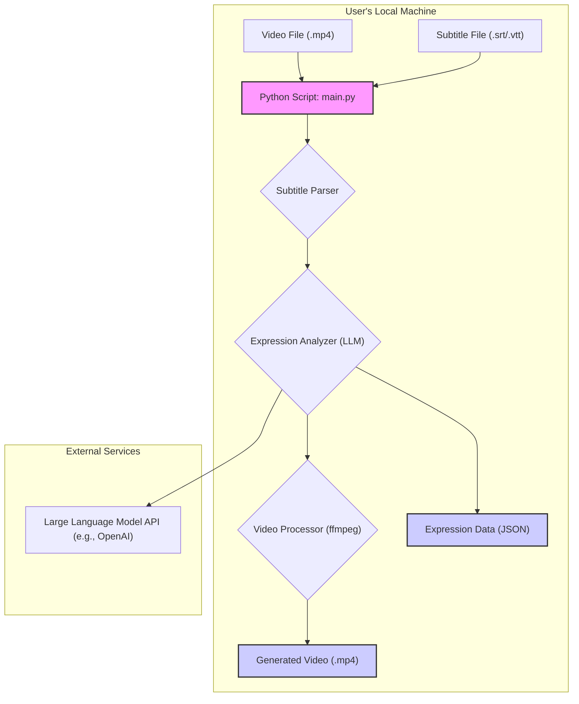

# LangFlix: System Design and Development Plan

This document outlines the system architecture and phased development plan for the LangFlix project, based on the initial `project_plan.md`.

## 1. System Architecture

The system is designed as a modular pipeline that processes video and subtitle files to produce educational content. The architecture is centered around a core processing script that can be executed from the command line.

### 1.1. High-Level Architecture Diagram



### 1.2. Component Breakdown

1.  **Main Controller (`main.py`)**:
    *   **Responsibility**: Orchestrates the entire workflow.
    *   **Functionality**: Takes input file paths (video and subtitles), calls the necessary modules in sequence, and handles configuration (e.g., target language, output path).

2.  **Subtitle Parser (`subtitle_parser.py`)**:
    *   **Responsibility**: Parses subtitle files into a structured format.
    *   **Input**: `.srt` or `.vtt` file path.
    *   **Output**: A list of subtitle objects, each containing `start_time`, `end_time`, and `text`.
    *   **Technology**: `pysrt` or `webvtt-py` library.

3.  **Expression Analyzer (`expression_analyzer.py`)**:
    *   **Responsibility**: Interacts with an LLM to extract learning content from dialogues.
    *   **Input**: A list of subtitle objects.
    *   **Functionality**:
        *   Groups dialogues into logical scenes or chunks.
        *   Constructs a prompt for the LLM.
        *   Calls the LLM API.
        *   Parses the LLM's JSON response.
    *   **Output**: A structured list of "learning cards," each with an expression, definition, translation, examples, and context-aware `[start_time, end_time]`.
    *   **Technology**: `openai` library.

4.  **Video Processor (`video_processor.py`)**:
    *   **Responsibility**: Creates video clips and assembles the final educational video.
    *   **Input**: Original video file path and the list of learning cards.
    *   **Functionality**:
        *   For each card, extract the corresponding video clip using the `[start_time, end_time]`.
        *   Generate "title cards" (images or short video clips) with the expression text and explanations.
        *   Concatenate the title cards and video clips into the final output video.
    *   **Technology**: `ffmpeg-python` library.

### 1.3. Data Models

#### Subtitle Entry (from Parser)

```json
{
  "index": 1,
  "start_time": "00:01:15,250",
  "end_time": "00:01:17,500",
  "text": "You gotta be kidding me."
}
```

#### Learning Card (from LLM)

```json
{
  "expression": "You gotta be kidding me.",
  "context_start_time": "00:01:14,000",
  "context_end_time": "00:01:18,000",
  "definition": "An expression of disbelief or astonishment.",
  "translation": {
    "korean": "농담하는 거겠지."
  },
  "similar_expressions": [
    "You can't be serious.",
    "Are you for real?"
  ]
}
```

## 2. Development Plan (Phased Approach)

This project will be developed in three main phases to ensure incremental progress and allow for feedback at each stage.

### Phase 1: Core Logic and Content Generation

**Goal**: To build the data processing backbone of the application. By the end of this phase, we should be able to generate a JSON file with all the necessary learning content from a subtitle file.

*   **Milestone 1.1: Setup Project Structure**:
    *   Create directories: `langflix/`, `tests/`, `data/`.
    *   Initialize `git` repository.
    *   Set up `requirements.txt` (`pysrt`, `openai`, `python-dotenv`).
    *   Create basic module files: `langflix/main.py`, `langflix/subtitle_parser.py`, `langflix/expression_analyzer.py`.

*   **Milestone 1.2: Implement Subtitle Parser**:
    *   Create a function to read a `.srt` file and return a list of subtitle entries.
    *   Write unit tests to verify parsing for various subtitle formats.

*   **Milestone 1.3: Implement Expression Analyzer**:
    *   Develop the prompt engineering strategy for the LLM. The prompt should request a structured JSON output.
    *   Implement the function to call the LLM API and parse the response.
    *   Add error handling for API failures or malformed JSON.
    *   Implement a "dry run" mode that prints the generated JSON instead of proceeding to video processing.

### Phase 2: Video Processing and Assembly

**Goal**: To add video manipulation capabilities. By the end of this phase, the tool will be able to generate a complete educational video.

*   **Milestone 2.1: Implement Video Clip Extraction**:
    *   Add `ffmpeg-python` to `requirements.txt`.
    *   Create a function in `video_processor.py` that takes a video path and `[start, end]` times and saves a new clip.
    *   Test with various time formats.

*   **Milestone 2.2: Implement Title Card Generation**:
    *   Use a library like `Pillow` to generate images with text for expressions and definitions.
    *   Convert these images into short video clips using `ffmpeg`.

*   **Milestone 2.3: Implement Final Video Assembly**:
    *   Create a function to concatenate all the generated clips (title cards and context clips) in the correct order.
    *   Ensure smooth transitions and consistent audio levels.

### Phase 3: Refinement and Usability

**Goal**: To make the tool robust, configurable, and easy to use.

*   **Milestone 3.1: Configuration and CLI**:
    *   Use `argparse` or `click` to create a user-friendly command-line interface.
    *   Allow users to specify input/output paths, target language, and number of expressions.
    *   Use a `.env` file for API keys.

*   **Milestone 3.2: Logging and Error Reporting**:
    *   Implement structured logging to track the progress of the pipeline.
    *   Provide clear error messages to the user (e.g., "ffmpeg not found," "Invalid API key").

*   **Milestone 3.3: Documentation**:
    *   Write a `README.md` with clear instructions on how to install and run the project.
    *   Document the code and module responsibilities.

## 3. Technology Stack Summary

| Component             | Technology/Library                               | Justification                                         |
| --------------------- | ------------------------------------------------ | ----------------------------------------------------- |
| **Language**          | Python 3.9+                                      | Rich ecosystem for data processing, AI, and scripting.|
| **Subtitle Parsing**  | `pysrt`                                          | Simple and effective for handling `.srt` files.       |
| **LLM Interaction**   | `openai`                                         | Official and well-supported client for OpenAI models. |
| **Video Processing**  | `ffmpeg-python`                                  | Powerful and standard tool for video manipulation.    |
| **CLI**               | `argparse` (standard library)                    | Sufficient for the project's needs; no extra deps.    |
| **Environment Mgmt**  | `venv`, `requirements.txt`, `python-dotenv`      | Standard and lightweight Python practices.            |

This plan provides a clear path forward. We will start with Phase 1 to build the core data pipeline before moving on to the more complex video processing tasks.
