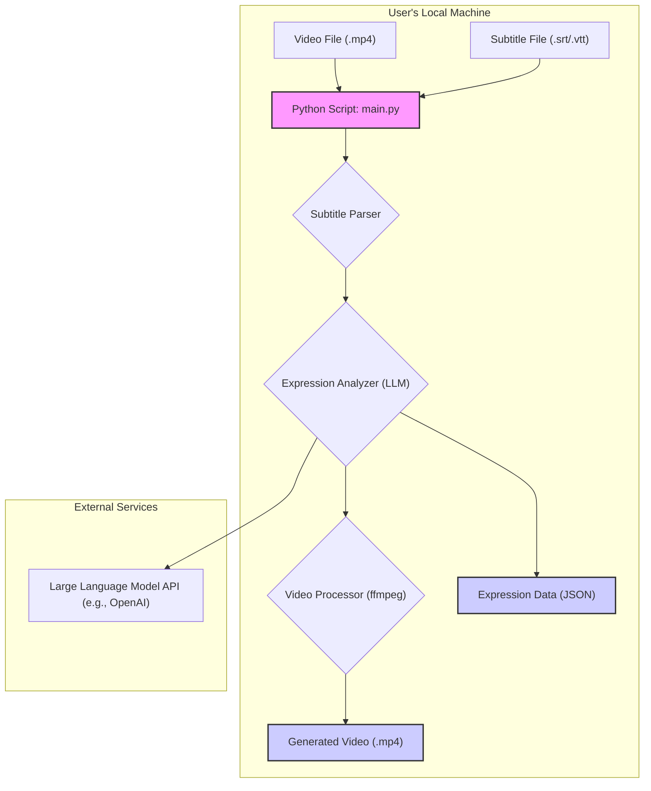

# LangFlix: 시스템 설계 및 개발 계획

본 문서는 초기 `project_plan.md`를 기반으로 LangFlix 프로젝트의 시스템 아키텍처 및 단계별 개발 계획을 설명합니다.

-----

## 1\. 시스템 아키텍처 (System Architecture)

시스템은 영상 및 자막 파일을 처리하여 교육 콘텐츠를 생성하는 모듈식 파이프라인으로 설계되었습니다. 핵심 아키텍처는 명령줄(CLI)에서 실행될 수 있는 핵심 처리 스크립트를 중심으로 구성됩니다.

### 1.1. 상위 수준 아키텍처 다이어그램 (High-Level Architecture Diagram)



### 1.2. 구성 요소 세부 분석 (Component Breakdown)

1.  **메인 컨트롤러 (`main.py`)**:

      * **책임**: 전체 워크플로우를 조정합니다.
      * **기능**: 입력 파일 경로(영상 및 자막)를 받고, 필요한 모듈을 순차적으로 호출하며, 구성 설정(예: 대상 언어, 출력 경로)을 처리합니다.

2.  **자막 파서 (`subtitle_parser.py`)**:

      * **책임**: 자막 파일을 구조화된 형식으로 구문 분석합니다.
      * **입력**: `.srt` 또는 `.vtt` 파일 경로.
      * **출력**: 각 항목에 `start_time`, `end_time`, `text`를 포함하는 **자막 객체 목록**.
      * **기술**: `pysrt` 또는 `webvtt-py` 라이브러리.

3.  **표현 분석기 (`expression_analyzer.py`)**:

      * **책임**: LLM(대규모 언어 모델)과 상호작용하여 대화에서 학습 콘텐츠를 추출합니다.
      * **입력**: 자막 객체 목록.
      * **기능**:
          * 대화를 논리적 장면 또는 청크로 그룹화합니다.
          * LLM을 위한 프롬프트(Prompt)를 구성합니다.
          * LLM API를 호출합니다.
          * LLM의 JSON 응답을 구문 분석합니다.
      * **출력**: 표현, 정의, 번역, 예시, 그리고 문맥에 맞는 `[start_time, end_time]`을 포함하는 구조화된 **"학습 카드" 목록**.
      * **기술**: `openai` 라이브러리.

4.  **영상 처리기 (`video_processor.py`)**:

      * **책임**: 영상 클립을 생성하고 최종 교육용 영상을 조립합니다.
      * **입력**: 원본 영상 파일 경로 및 학습 카드 목록.
      * **기능**:
          * 각 카드에 대해 `[start_time, end_time]`을 사용하여 해당 영상 클립을 추출합니다.
          * 표현 텍스트와 설명이 포함된 "제목 카드"(이미지 또는 짧은 영상 클립)를 생성합니다.
          * 제목 카드와 추출된 영상 클립을 최종 출력 영상으로 연결(Concatenate)합니다.
      * **기술**: `ffmpeg-python` 라이브러리.

### 1.3. 데이터 모델 (Data Models)

#### 자막 항목 (파서 출력)

```json
{
  "index": 1,
  "start_time": "00:01:15,250",
  "end_time": "00:01:17,500",
  "text": "You gotta be kidding me."
}
```

#### 학습 카드 (LLM 출력)

```json
{
  "expression": "You gotta be kidding me.",
  "context_start_time": "00:01:14,000",
  "context_end_time": "00:01:18,000",
  "definition": "An expression of disbelief or astonishment.",
  "translation": {
    "korean": "농담하는 거겠지."
  },
  "similar_expressions": [
    "You can't be serious.",
    "Are you for real?"
  ]
}
```

-----

## 2\. 개발 계획 (단계별 접근 방식) (Development Plan - Phased Approach)

본 프로젝트는 점진적인 진행을 보장하고 각 단계에서 피드백을 반영할 수 있도록 세 가지 주요 단계로 개발될 것입니다.

### 1단계: 핵심 로직 및 콘텐츠 생성 (Phase 1: Core Logic and Content Generation)

**목표**: 애플리케이션의 **데이터 처리 백본**을 구축합니다. 이 단계가 끝나면 자막 파일로부터 필요한 모든 학습 콘텐츠가 포함된 JSON 파일을 생성할 수 있어야 합니다.

  * **마일스톤 1.1: 프로젝트 구조 설정**:

      * 디렉토리 생성: `langflix/`, `tests/`, `data/`.
      * `git` 저장소 초기화.
      * `requirements.txt` 설정 (`pysrt`, `openai`, `python-dotenv`).
      * 기본 모듈 파일 생성: `langflix/main.py`, `langflix/subtitle_parser.py`, `langflix/expression_analyzer.py`.

  * **마일스톤 1.2: 자막 파서 구현**:

      * `.srt` 파일을 읽고 자막 항목 목록을 반환하는 함수 생성.
      * 다양한 자막 형식에 대한 구문 분석을 확인하는 단위 테스트 작성.

  * **마일스톤 1.3: 표현 분석기 구현**:

      * LLM을 위한 **프롬프트 엔지니어링** 전략 개발. 프롬프트는 구조화된 JSON 출력을 요청해야 합니다.
      * LLM API를 호출하고 응답을 구문 분석하는 함수 구현.
      * API 오류 또는 잘못된 형식의 JSON에 대한 오류 처리 추가.
      * 영상 처리로 진행하는 대신 생성된 JSON을 출력하는 "드라이 런(dry run)" 모드 구현.

### 2단계: 영상 처리 및 조립 (Phase 2: Video Processing and Assembly)

**목표**: 영상 조작 기능을 추가합니다. 이 단계가 끝나면 도구는 완전한 교육용 영상을 생성할 수 있게 됩니다.

  * **마일스톤 2.1: 영상 클립 추출 구현**:

      * `requirements.txt`에 `ffmpeg-python` 추가.
      * `video_processor.py`에 영상 경로와 `[start, end]` 시간을 받아 새 클립을 저장하는 함수 생성.
      * 다양한 시간 형식으로 테스트.

  * **마일스톤 2.2: 제목 카드 생성 구현**:

      * `Pillow`와 같은 라이브러리를 사용하여 표현과 정의 텍스트가 포함된 이미지 생성.
      * `ffmpeg`을 사용하여 이 이미지를 짧은 영상 클립으로 변환.

  * **마일스톤 2.3: 최종 영상 조립 구현**:

      * 생성된 모든 클립(제목 카드와 문맥 클립)을 올바른 순서로 연결하는 함수 생성.
      * 부드러운 전환과 일관된 오디오 레벨 보장.

### 3단계: 개선 및 사용성 (Phase 3: Refinement and Usability)

**목표**: 도구를 견고하고, 구성 가능하며, 사용하기 쉽게 만듭니다.

  * **마일스톤 3.1: 구성 및 CLI (명령줄 인터페이스)**:

      * `argparse` 또는 `click`을 사용하여 사용자 친화적인 CLI 생성.
      * 사용자가 입력/출력 경로, 대상 언어, 표현 개수 등을 지정할 수 있도록 허용.
      * API 키를 위한 `.env` 파일 사용.

  * **마일스톤 3.2: 로깅 및 오류 보고**:

      * 파이프라인 진행 상황을 추적하기 위해 구조화된 로깅 구현.
      * 사용자에게 명확한 오류 메시지 제공 (예: "ffmpeg를 찾을 수 없음", "잘못된 API 키").

  * **마일스톤 3.3: 문서화**:

      * 프로젝트 설치 및 실행 방법에 대한 명확한 지침이 포함된 `README.md` 작성.
      * 코드 및 모듈 책임 문서화.

-----

## 3\. 기술 스택 요약 (Technology Stack Summary)

| 구성 요소 | 기술/라이브러리 | 사용 이유 |
| :--- | :--- | :--- |
| **언어** | Python 3.9+ | 데이터 처리, AI, 스크립팅을 위한 풍부한 생태계. |
| **자막 구문 분석** | `pysrt` | `.srt` 파일 처리에 간단하고 효과적. |
| **LLM 상호작용** | `openai` | OpenAI 모델을 위한 공식적이며 잘 지원되는 클라이언트. |
| **영상 처리** | `ffmpeg-python` | 영상 조작을 위한 강력하고 표준적인 도구. |
| **CLI** | `argparse` (표준 라이브러리) | 프로젝트 요구사항에 충분하며 추가 의존성 불필요. |
| **환경 관리** | `venv`, `requirements.txt`, `python-dotenv` | 표준적이고 경량화된 Python 관행. |

이 계획은 명확한 진행 경로를 제공합니다. 더 복잡한 영상 처리 작업으로 넘어가기 전에 핵심 데이터 파이프라인을 구축하기 위해 1단계부터 시작할 것입니다.